# 海韵智耕 — 商业计划书

> **用 AI 守护每一寸土地，用科技激活每一份资源**

| 项目 | 信息 |
|------|------|
| **项目名称** | 海韵智耕 |
| **业务定位** | AI Agent 智慧农场 SaaS + 农产品副产品深加工 |
| **本轮融资** | 200 万元（种子轮/天使轮），出让 10%–15% |
| **投后估值** | 1,500–2,000 万元 |
| **团队** | 罗应杰（CTO/CEO）、黄子格（CSO/COO） |
| **指导教师** | 梁秀娟（商业模式与创业指导） |
| **所属院校** | 广东海洋大学 |
| **日期** | 2026 年 4 月 |

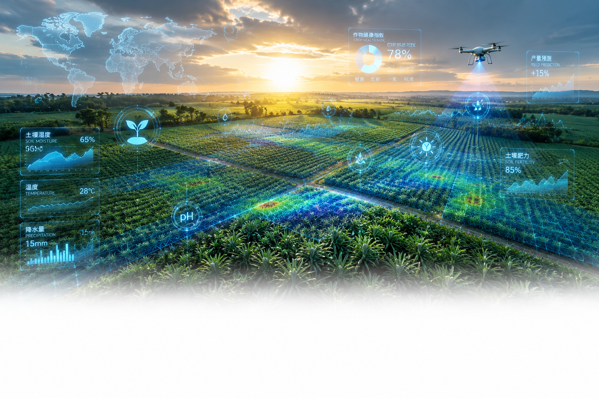

---

## 一、执行摘要

粤西 300 万亩热带作物种植面临五重困境：气象灾害频发、水肥管理粗放、病虫害预警缺失、劳动力老龄化、副产品大量浪费。现有智慧农业方案偏重硬件自动化，缺乏 AI 决策能力，且无一专注热带种植场景。

**海韵智耕** 以"AI Agent 智慧农场 SaaS + 农产品副产品深加工"双轮驱动，切入这个千亿级空白市场：

| 维度 | 核心数据 |
|------|---------|
| **市场空间** | TAM 50 亿元（粤西热带作物场景），SAM 5–6 亿元 |
| **产品** | 8 大 AI Agent 模块，MVP 阶段聚焦气象预警 + 土壤墒情 |
| **商业模式** | SaaS 年费 400–1,000 元/亩 + 硬件搭售 + 加工产品 B2B |
| **第 3 年营收** | 950 万元（最可能情景），毛利率 60% |
| **团队壁垒** | 全国唯一大气科学 × 热带农业 × AI 跨学科创业团队 |
| **本轮需求** | 200 万元，40% 研发 + 30% 市场 + 20% 加工中试 + 10% 运营 |
| **3 年投资人回报** | 3.6x 回报倍数，IRR ≈ 53% |

本计划书详细阐述了从技术架构到财务模型、从冷启动策略到风险应对的完整商业逻辑。

---

## 二、痛点：粤西农业的五道"锁链"

### 2.1 每一道锁链都在吃掉种植户的利润

| # | 痛点 | 现状 | 损失量化 |
|---|------|------|---------|
| **1** | 气象灾害频发 | 湛江地处北热带季风区，台风/暴雨/干旱交替冲击 | 徐闻菠萝产量波动中气象因子占比 98.45% |
| **2** | 水肥管理粗放 | 施肥靠经验，灌溉凭感觉，过量施用导致面源污染 | 智能水肥一体化渗透率不足 20% |
| **3** | 病虫害预警缺失 | 热带作物病虫害种类多、爆发快，人工巡检频次低 | 发现时往往已大面积蔓延，错过防治窗口 |
| **4** | 劳动力老龄化 | 湛江农业从业者平均年龄 55 岁以上，年轻劳动力外流 | 无人农场人力成本可下降 65% |
| **5** | 副产品大量浪费 | 菠萝皮渣、甘蔗秸秆等占原料重量 30%–60%，多数填埋焚烧 | 每吨废弃物损失潜在加工增值 20–40 倍 |

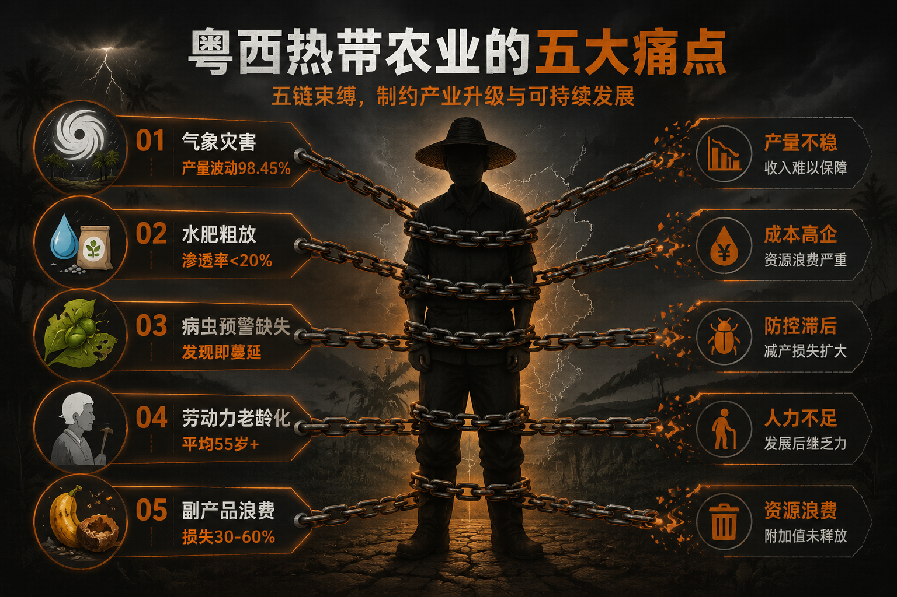

### 2.2 种植户的一天：6 个痛点时刻

| 时间 | 活动 | 痛点 | 痛苦指数 |
|------|------|------|---------|
| 6:00 | 巡田观察作物长势 | 步行到每块田，耗时 2 小时 | ⭐⭐⭐ |
| 8:00 | 决定今天是否浇水施肥 | 怕多浇浪费，怕少浇减产，全凭感觉 | ⭐⭐⭐⭐ |
| 10:00 | 查天气预报 | 只有通用温度降雨，无农业专用预报 | ⭐⭐ |
| 14:00 | 高温期检查病虫害 | 发现时往往已蔓延，全靠肉眼经验 | ⭐⭐⭐⭐⭐ |
| 17:00 | 记录农事日志 | 纸质本子记录，容易丢、难复盘 | ⭐⭐ |
| 20:00 | 准备明日农事计划 | 无数据支撑，只能靠经验估算 | ⭐⭐⭐ |

### 2.3 实地调研：5 户种植户告诉我们的真相

> 2025 年 12 月—2026 年 2 月，团队走访徐闻、雷州、遂溪三地 5 户种植户，以下是核心发现。

| 编号 | 化名 | 位置 | 规模 | 年龄 | 第一痛点 | 数字化意愿 | 愿意年付 |
|------|------|------|------|------|---------|-----------|---------|
| #01 | 陈叔 | 徐闻曲界镇 | 80 亩菠萝 | 55 | 怕台风/暴雨，不会看天气预报 | 想用但怕学不会 | 300–500 元 |
| #02 | 吴老板 | 雷州覃斗镇 | 120 亩芒果+荔枝 | 34 | 病虫害控制不住，年年减产 | 愿意学，已有抖音基础 | 800–1,200 元 |
| #03 | 阿强 | 遂溪洋青镇 | 200 亩甘蔗 | 42 | 雇人越来越贵，想用机器 | 积极，已用大疆打药 | 500–800 元 |
| #04 | 李大伯 | 徐闻龙塘镇 | 50 亩菠萝+香蕉 | 62 | 儿子进城了，自己种不动 | 如果儿子帮弄就用 | 200–300 元（儿子付） |
| #05 | 徐闻菠萝合作社 | 徐闻县 | 500 亩（联合） | — | 统一品控难，想拿绿色认证 | 非常高，有预算 | 5–10 万/年 |

**三大关键发现**：

1. **价格不是第一决策因素** — 信任和可见效果才是。陈叔说"怕学不会"比"怕贵"更强烈。
2. **代际鸿沟是真实的** — 35 岁以下种植户数字化意愿显著高于 55 岁以上。
3. **"看到效果再付费"是共识** — 90% 的受访对象如果看到增产数据就愿意付费，验证了"免费试用+案例说服"的冷启动路径。

> ⚠️ **数据说明**：当前样本 5 户为深度定性访谈，非统计抽样。核心价值在于发现趋势假设，为后续 ≥50 份定量问卷提供方向。

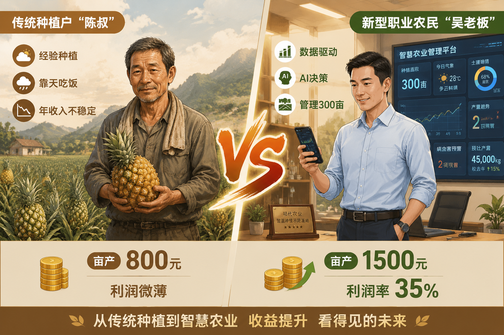

---

## 三、解决方案：海韵智耕双轮驱动

### 3.1 业务概览

| 业务线 | 解决什么 | 怎么解决 | 核心价值指标 |
|--------|---------|---------|------------|
| **AI Agent 智慧农场** | 种植决策靠经验、气象灾害无预警、病虫害反应慢 | 多模态感知终端 + 气象-土壤联合预警 + 智能水肥决策 Agent | 降低种植风险 60%，水肥成本↓15–20%，亩产↑25% |
| **副产品深加工** | 果皮/秸秆占原料 30%–60%，多被填埋焚烧 | 菠萝/芒果皮渣→酵素/果酒/饲料；甘蔗秸秆→生物质复合材料 | 废弃物增值 20–30 倍 |

### 3.2 技术架构：四层 AI Agent 平台

```
┌─────────────────────────────────────────────────┐
│          应用层：种植户小程序 + PC 管理后台 + 告警推送    │
├─────────────────────────────────────────────────┤
│          平台层：AI 模型引擎（气象预测/墒情预警/水肥优化）  │
├─────────────────────────────────────────────────┤
│          传输层：LoRa 网关 + 4G DTU → 云端          │
├─────────────────────────────────────────────────┤
│          感知层：土壤传感器 + 微型气象站 + 病虫害摄像头    │
└─────────────────────────────────────────────────┘
```

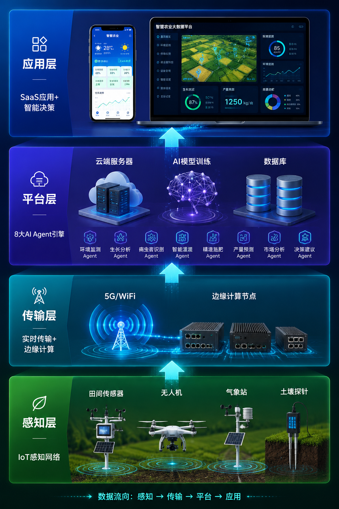

### 3.3 八大 AI Agent 模块

| 模块 | 功能 | 技术路线 |
|------|------|---------|
| **气象预警 Agent** | ECMWF 数值预报 + 本地气象站 → 7 天逐小时农业气象预报 | 时序预测 + 大气物理约束 |
| **土壤墒情 Agent** | 土壤温湿度/pH/EC/氮磷钾监测 → 24–48h 墒情预测 | LSTM 土壤动力学模型 |
| **智能水肥 Agent** | 土壤数据 + 作物生育阶段 + 气象条件 → 最优灌溉施肥方案 | 多因子决策模型 |
| **病虫害预警 Agent** | 气象 + 叶片图像 + 历史病虫害 → 风险评分 | 多模态融合 YOLOv8 |
| **自动灌溉 Agent** | 土壤含水量达阈值 → 联动智能灌溉启停 | 规则引擎 + 传感器联动 |
| **农事日志 Agent** | 自动记录灌溉/施肥/施药/收获 → 种植档案与溯源报告 | NLG 自动生成 |
| **市场行情 Agent** | 对接湛江批发市场价格 → 作物出塘建议 | 数据爬取 + 趋势分析 |
| **专家问答 Agent** | GDOU 农业知识库 + 本地种植经验 → 7×24h 问答 | RAG 检索增强生成 |

> **MVP 聚焦策略**：对种植户而言，1 个准确的灾害预警比 8 个未经验证的模块更有价值。极飞 2,300+ 农场的规模化落地也只依赖水肥管理一个核心功能。**路线图中的 8 个 Agent 展示技术愿景，MVP 中的 2 个 Agent 验证工程执行力。**

### 3.4 技术路线：哪些自研，哪些复用

| 模块 | 实现方式 | 说明 |
|------|---------|------|
| 气象预警 Agent | 调用 ECMWF/CMA 公开 API + 规则引擎 | 不自研气象模型，专注农业场景化输出 |
| 土壤墒情 Agent | 开源时序模型（LightGBM/LSTM）fine-tune | 土壤数据量可控，微调成本低 |
| 病虫害预警 Agent | GDOU 菠萝科技小院 YOLOv8 成果迁移 | 已有基础模型，迁移至病害识别 |
| 智能水肥/其余 Agent | 规则引擎 + 简单 ML 模型逐步叠加 | 复杂决策用 RAG + 知识库兜底 |
| 大模型支撑 | 接入 DeepSeek-V3/通义千问 API | 不训练基座模型，专注 Prompt Engineering + RAG |

### 3.5 副产品加工：OEM 先行，条件触发自营

**产品线矩阵**：

| 产品线 | 原料 | 核心技术 | 目标市场 | 预计毛利率 |
|--------|------|---------|---------|-----------|
| 菠萝酵素/果酒 | 菠萝皮渣/废弃小果 | 生物发酵 | 食品饮料/保健品 | 40–50% |
| 生物质复合材料 | 甘蔗秸秆/菠萝叶纤维 | 热压复合（木塑） | 建材/家具/包装 | 45–55% |
| 有机肥/生物酶 | 废弃果皮+畜禽粪污 | 好氧发酵 | 有机农业/土壤改良 | 35–45% |

**增值效应**：

| 原料 | 原始价值 | 加工后产品价值 | 增值倍数 |
|------|---------|-------------|---------|
| 1 吨菠萝皮渣 | ≈ 100 元（废弃物） | 菠萝酵素 ≈ 4,000 元 | **40x** |
| 1 吨甘蔗秸秆 | ≈ 150 元（焚烧/填埋） | 木塑复合材料 ≈ 3,500 元 | **23x** |
| 1 吨废弃小果 | ≈ 200 元（丢弃） | 有机肥 ≈ 2,000 元 | **10x** |

**OEM → 自营切换门槛**：以下三项全部达成后启动自建产线——

1. OEM 代工订单连续 3 个月月均 ≥ 2 吨
2. 至少 3 家 B2B 客户签订年度采购意向协议
3. 天使轮资金到账后仍有 ≥ 50 万元剩余预算

> 第 1 年加工业务定位为"市场验证窗口"——OEM 试产 1–2 吨样品测试客户反馈，不追求收入。第 1 年全部现金流依赖 SaaS+硬件。初创阶段资源有限，必须高度聚焦核心业务。

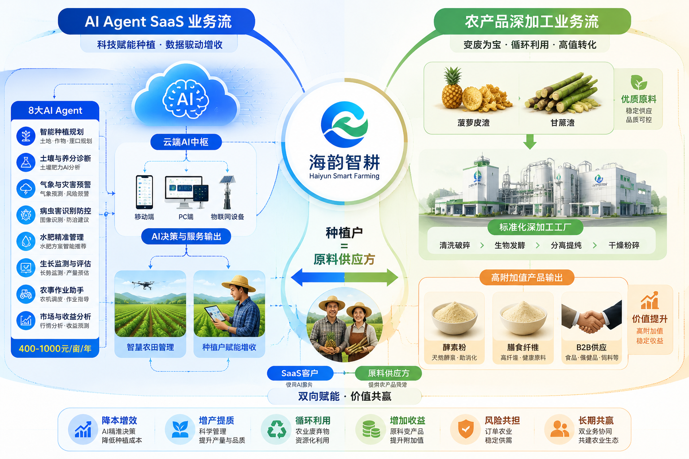

---

## 四、市场：一个 50 亿的粤西机会

### 4.1 市场空间：从底向上测算

| 层级 | 范围 | 测算逻辑 | 规模 |
|------|------|---------|------|
| **TAM** | 粤西热带作物 SaaS + 副产品加工的理论天花板 | 337 万亩 × 600 元/亩 + 250 万吨副产物加工 | **≈ 50 亿元** |
| **SAM** | 湛江 1,200 户规模 ≥50 亩的新型经营主体 + 就近原料加工 | 1,200 户 × 1.2 万/年 + 区域 B2B 需求 | **≈ 5–6 亿元** |
| **SOM** | 3 年内湛江渗透率目标 | 第 1 年 50 户 → 第 2 年 200 户 → 第 3 年 500 户 | **第 3 年 ≈ 950 万营收** |

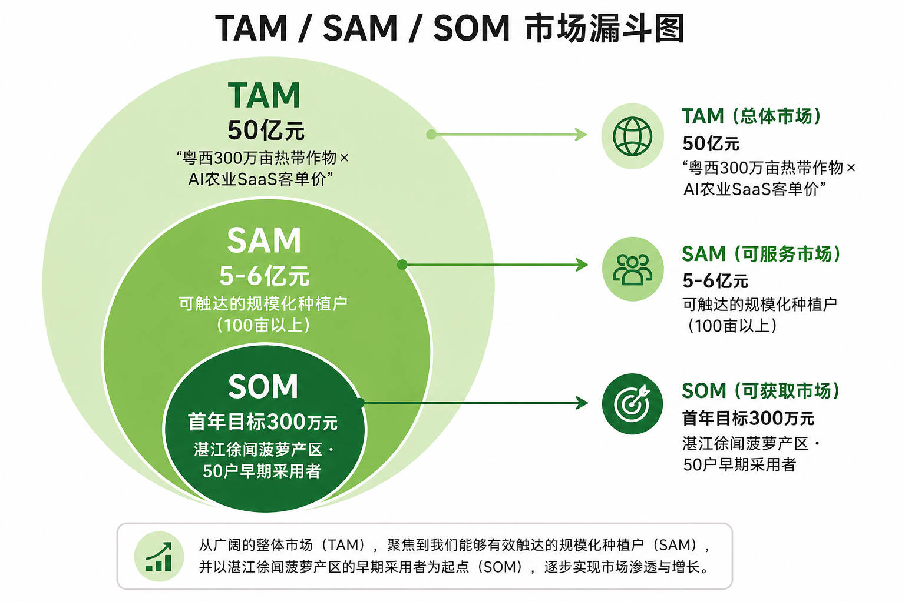

### 4.2 湛江热带作物种植基准数据

| 作物 | 种植面积 | 年产量 | 年产值（估算） |
|------|---------|-------|-------------|
| 菠萝（徐闻为主） | 32.74 万亩 | 79.22 万吨 | 54.35 亿元 |
| 芒果（雷州为主） | 6 万亩+ | 3.25 万吨 | ≈ 6 亿元 |
| 甘蔗（遂溪/徐闻） | 159.42 万亩 | 959.37 万吨 | ≈ 50 亿元 |
| **湛江可服务种植面积合计** | **≈ 337 万亩** | — | — |

### 4.3 市场时机：窗口期判断

| 信号 | 状态 | 含义 |
|------|------|------|
| 大模型 API 化成熟（DeepSeek/通义千问） | ✅ 已就绪 | 小团队也能构建专业 AI Agent |
| IoT 传感器成本较 5 年前下降 60%+ | ✅ 已就绪 | 规模化部署具备经济性 |
| 湛江行政村 5G 覆盖率 > 80% | ✅ 已就绪 | 实时数据传输无阻碍 |
| 广东智慧农业补贴集中释放（年投入 5 亿元） | ✅ 窗口期 | 政策红利叠加 |
| 热带种植业 AI Agent 竞品 | ❌ 空白 | 尚无专注此细分赛道的产品 |

**判断**：进入时机刚刚好 — 不是太早（技术已可用），不是太晚（竞品尚未进场），窗口期约 **2–3 年**。

### 4.4 用户画像

| 维度 | Persona A：传统种植大户 | Persona B：新型职业农民 | Persona C：合作社/企业基地 |
|------|----------------------|---------------------|------------------------|
| 姓名 | 陈叔 | 小吴 | 徐闻某菠萝合作社 |
| 年龄 | 55 岁 | 28 岁 | — |
| 规模 | 80 亩 | 120 亩 | 500 亩+ |
| 年收入 | 30–50 万 | — | 规模采购预算 5–10 万/年 |
| 核心需求 | 简单、可靠、不用我动脑子 | 性价比高、数据帮我做决策 | 统一管理、标准流程、可溯源 |
| 触达方式 | 农资经销商/推广站推荐 | 短视频/微信社群/行业展会 | 政府推荐+行业展会 |

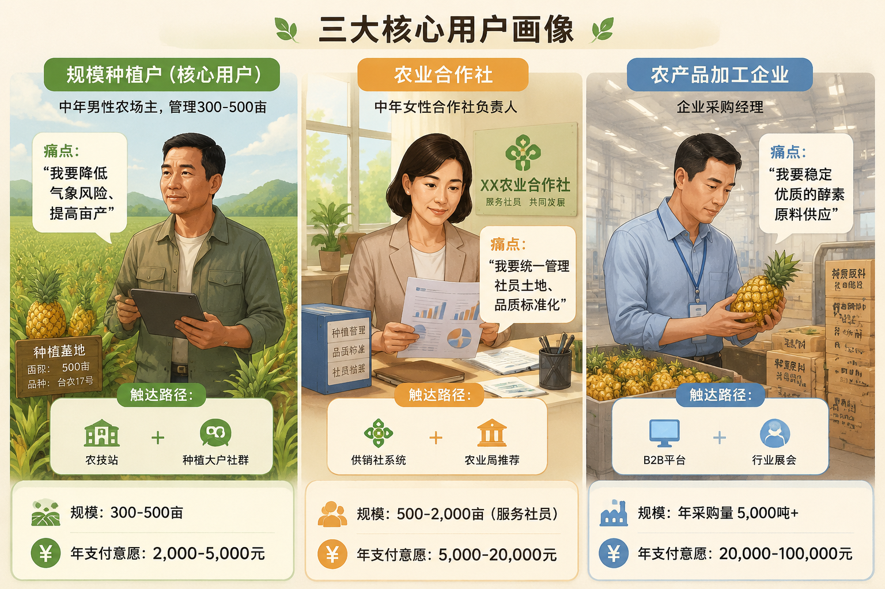

---

## 五、竞争：为什么是我们

### 5.1 竞争格局

| 竞争对手 | 业务 | 优势 | 弱点 | 与我们关系 |
|---------|------|------|------|-----------|
| **极飞科技** | 农业无人机+智慧农业 | 水肥管理 2,300+ 农场，硬件渠道强 | 侧重硬件自动化，AI 决策 Agent 能力弱 | 互补 > 竞争 |
| **大疆农业** | 农业无人机 | 全球市占率 59% | 不提供种植决策 AI，纯硬件 | 互补 |
| **联通数村** | 通用农业数字化平台 | 运营商资源 | 缺乏种植业专项能力 | 弱竞争 |
| **阿里云 IoT 农业** | 大农业 IoT 平台 | 技术/资金雄厚 | 不做垂直场景深耕 | 中长期潜在威胁 |
| **华农无人农场** | 水稻无人化种植 | 顶尖技术团队 | 偏科研，商业化弱，非热带作物 | 非竞争 |

### 5.2 我们的核心壁垒

| 壁垒类型 | 具体内容 | 构建周期 | 可复制难度 |
|---------|---------|---------|-----------|
| **数据壁垒** | 粤西热带作物多年种植 + 气象-土壤联合数据集 | 3–5 年 | 高 — 需从头积累完整种植周期 |
| **跨学科壁垒** | 大气科学 × 土壤动力学联合模型 | 12–18 月 | 高 — 跨学科人才稀缺 |
| **产学研壁垒** | GDOU 滨海农业学院/海洋与气象学院深度合作 | 6–12 月 | 中高 — 实质排他窗口 2–3 年 |
| **本地化壁垒** | 湛江驻地团队 + 农资经销商渠道网络 | 12–24 月 | 中 — 线下团队深耕即可筑墙 |
| **品牌先发** | 粤西热带农业 AI 第一品牌认知 | 24–36 月 | 中 — 先发优势有窗口期 |

### 5.3 极飞对比：不是竞品，是参照系

极飞水肥管理系统已落地 2,300+ 农场，累计融资超 30 亿元。看似强大，但本质是**硬件自动化**，不是**决策智能化**：

| 能力维度 | 极飞方案 | 海韵智耕方案 |
|---------|---------|-------------|
| 数据来源 | 传感器实时数据 | 传感器 + 气象预报 + 历史数据 + 卫星遥感 |
| 决策方式 | 阈值触发（湿度 < X → 灌溉） | AI 预测模型（未来 24h 降雨量 → 推迟灌溉） |
| 覆盖场景 | 水肥管理单一场景 | 气象预警 + 土壤 + 病虫害 + 水肥 + 市场行情 |
| 扩展性 | 硬件绑定，扩展需加装设备 | SaaS 纯软件，OTA 新增功能 |
| 数据价值 | 实时监控，数据不跨户 | 跨户聚合 → 区域种植知识图谱 |

### 5.4 大厂入场怎么办？

这是投资人最关心的问题，我们正面回答：

| 维度 | 大厂优势 | 海韵智耕的生存逻辑 |
|------|---------|------------------|
| **研发预算** | 是我们的 100x | 大厂做农业 AI 属业务线延伸——一个事业部中的一条产品线。本团队全部资源聚焦单一赛道。**资源密度与专注度不同** |
| **渠道网络** | 极飞 2,300+ 农场 | 大厂渠道覆盖高预算大型农场，本团队聚焦 50–200 亩的中小种植户——这一客群大厂的渠道半径难以经济地覆盖 |
| **数据壁垒** | 极飞有灌溉硬件数据 | 本团队气象×土壤×病虫害×水肥的**多模态联合数据集**，极飞只有单一硬件维度。多维度数据门槛高一个数量级 |
| **本地化** | 总部在一线城市 | 本团队驻扎湛江，每周实地走访徐闻/雷州种植基地，与各乡镇农业部门保持直接对接。**线下服务的响应深度与信任密度是远程管理模式难以复制的** |

**结论**：大型企业进入赛道是大概率事件，但本团队拥有 2–3 年的窗口期构建护城河。届时后发者将面临较高的替代成本，更可能的路径是收购而非直接竞争。

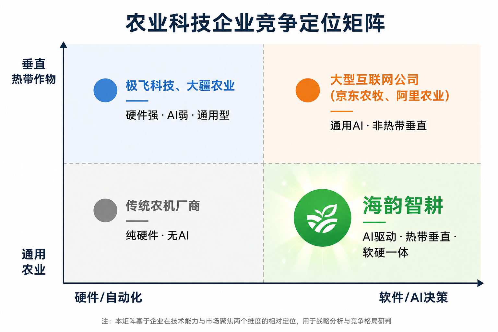

---

## 六、商业模式：SaaS 为核心的增长引擎

### 6.1 商业模式画布

| 模块 | 内容 |
|------|------|
| **客户细分** | ① 粤西热带作物种植户（个体/合作社/企业）② 食品/建材/有机肥采购商 |
| **价值主张** | AI Agent 替代人工巡田+经验决策，降低种植风险；农业废弃物高值化，创造第二收入 |
| **渠道通路** | 农资经销商（核心渠道）+ GDOU 校友网络 + 政府推广站 + 微信私域 + 行业展会 |
| **客户关系** | 1 对 1 农技顾问（每人服务 20 户）+ 24h AI 客服 + 种植户社群 |
| **收入来源** | SaaS 年费 + 硬件销售 + 加工产品 B2B + 技术服务费 |
| **核心资源** | AI 算法团队 + GDOU 科研合作 + 专利/数据资产 + 本地化运营团队 |
| **关键业务** | AI 平台研发与运维 + 种植户拓展与维护 + 加工产线运营 + 政府关系维护 |
| **重要合作** | 广东海洋大学 + 湛江农业行业协会 + 农资供应商 + 地方政府农业农村局 |
| **成本结构** | 研发人员薪资（60%）+ 硬件采购 + 车间租赁/设备折旧 + 市场推广 + 行政管理 |

### 6.2 收入引擎一：SaaS 订阅

| 套餐 | 年费 | 功能 | 目标客户 |
|------|------|------|---------|
| **基础版** | 400 元/亩 | 土壤监测 + 气象预警 + 农事日志 | 个体种植户 |
| **专业版** | 1,000 元/亩 | 基础版 + 智能水肥 + 病虫害预警 | 中等规模种植户 |
| **企业版** | 按需报价 | 专业版 + 自动灌溉 + 市场行情 + 多田管理 | 合作社/企业基地 |

> **定价逻辑**：使用 AI 平台后，亩均利润提升 ≈ 2,000–4,000 元/年。订阅费 400 元仅占增值的 10–20%。用户先看到价值，再支付费用。

### 6.3 收入引擎二：硬件搭售

| 设备 | 单价 | 毛利率 | 策略 |
|------|------|--------|------|
| 多参数土壤传感器 | 2,000 元 | 30% | SaaS 搭售（荐），独立选购 |
| 微型气象站 | 3,000 元 | 25% | SaaS 搭售 |
| 病虫害监测摄像头 | 600 元 | 35% | SaaS 搭售 |
| 智能灌溉控制器 | 1,200 元 | 30% | 可选配件 |

**硬件搭售的战略含义**：硬件不仅是收入来源，更是**数据入口**。每套传感器都是一个数据节点——用户越多，模型越准，壁垒越高。

### 6.4 收入引擎三：副产品加工（条件启动）

| 产品 | 年产目标（自营后） | 单价 | 年收入 |
|------|-----------------|------|--------|
| 菠萝酵素/果酒 | 20 吨 | 80 元/kg | 160 万元 |
| 木塑复合材料 | 30 吨 | 3,500 元/吨 | 10.5 万元 |
| 有机肥 | 200 吨 | 800 元/吨 | 16 万元 |

> ⚠️ 加工收入为条件预测——仅在市场验证条件达成后启动自营产线（详见 3.5 节切换门槛）。若条件未达成，加工收入为 0，SaaS+硬件仍能覆盖第 1–2 年运营。

### 6.5 增长飞轮

```
         ┌──────────────────┐
         │   种子用户验证     │
         │   （50 户）       │
         └────────┬─────────┘
                  │
         ┌────────▼─────────┐
         │   成功案例背书     │
         │   （数据对比）     │
         └────────┬─────────┘
                  │
    ┌─────────────┼─────────────┐
    ▼             ▼             ▼
┌────────┐  ┌────────┐  ┌────────┐
│农资经销商│  │政府推广站│  │老带新  │
│渠道复制│  │政策背书│  │口碑裂变│
└────┬───┘  └────┬───┘  └────┬───┘
     └───────────┼───────────┘
                 ▼
         ┌──────────────┐
         │ 更多种植户     │
         │ → 更多数据     │
         │ → AI 更精准    │
         │ → 价值更高     │
         └──────────────┘
                 │
           （回到起点，加速）
```

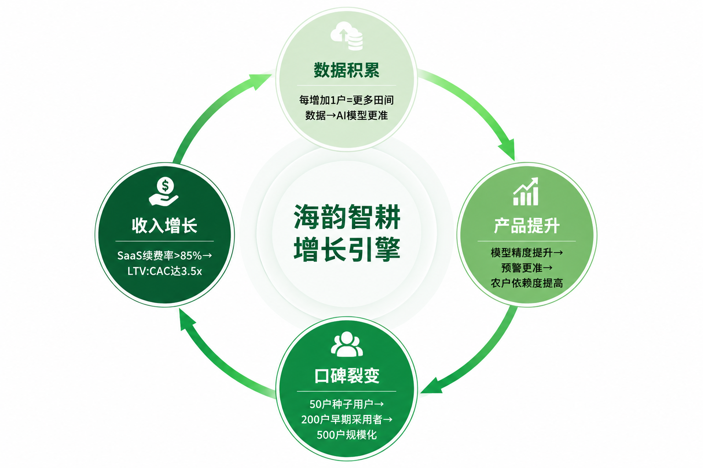

### 6.6 第一核心效率指标

| 业务线 | 开支最大项 | 第一效率指标 | 当前值（Y1） | 目标值（Y3） |
|-------|-----------|------------|-------------|-------------|
| AI SaaS | 人力成本（60%+） | **人效 = ARPU / 客户成功人员数** | 1.6 万/人 | 19 万/人 |
| SaaS 健康度 | — | **续费率 + 专业版占比** | — | 续费率 70% + 专业版 50% |
| 加工业务 | 原料采购+设备折旧 | **产能利用率** | OEM 模式（0 资产风险） | 自营产线 > 70% |

---

## 七、进入市场：三步冷启动

### 7.1 三年增长路径

| 年份 | 阶段 | 核心动作 | 用户目标 | 收入目标 |
|------|------|---------|---------|---------|
| **Y1 验证期** | 种子验证 | GDOU 校友网络定向邀请 + 农资经销商推荐 + 政府推广站免费试用 | 50 户 | 82.5 万 |
| **Y2 放大期** | 渠道复制 | 签约 5–8 家农资经销商 + 10 户案例视频 + 徐闻/雷州示范田挂牌 | 200 户 | 400 万 |
| **Y3 加速期** | 品牌溢价 | 对接湛江智慧农业补贴 + 区域种植户自传播 + 酵素品牌化反哺 | 500 户 | 950 万 |

### 7.2 获客策略

**转化漏斗**：

```
触达 5,000 户 ──→ 免费试用 500 户（10%）──→ 付费 100 户（20%）──→ 推荐 25 户（25%）
```

**核心渠道排序**（按 CAC 效率）：

| 渠道 | CAC 预估 | 转化率 | 优先级 |
|------|---------|--------|--------|
| 农资经销商推荐 | 低 | 高（信任背书最强） | 🥇 第一优先 |
| GDOU 校友网络 | 低 | 中高 | 🥈 冷启动首选 |
| 政府推广站 | 极低（借力） | 中 | 🥈 政策红利 |
| 微信私域运营 | 中 | 中 | 🥉 规模复制 |
| 抖音/快手视频 | 中低 | 低-中 | 🥉 品牌建设 |

### 7.3 产品迭代路线图

| 版本 | 时间 | 交付内容 | 团队规模 |
|------|------|---------|---------|
| **P0 种子期** | 第 1–2 月 | 硬件选型 + 小程序框架 + 气象数据接入 | 2 创始人 + 招聘中 |
| **P1 MVP** | 第 3–5 月 | 土壤监测 + 气象预警 + 农事日志 Agent | 4 人 |
| **P2 扩展** | 第 6–10 月 | 智能水肥 + 病虫害预警 v1 + 自动灌溉联动 | 4 人 + 1 兼职 |
| **P3 完整** | 第 11–14 月 | 全部 8 大 Agent 上线，完整种植周期验证 | 5 人 |

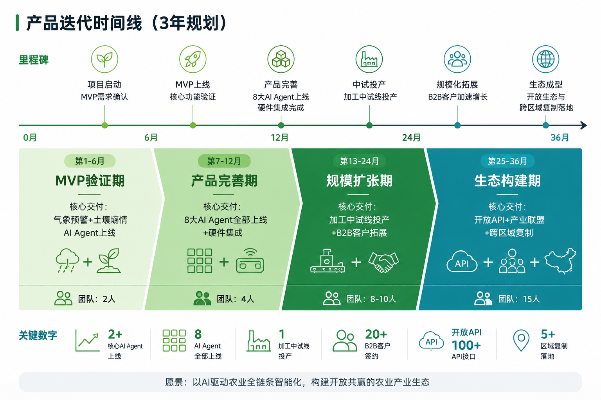

### 7.4 营销日历（第 1 年）

| 季度 | 重点 | 行动 |
|------|------|------|
| Q1 | 品牌建立 + 种子用户 | 建立公众号/视频号，对接首批 10 户体验官 |
| Q2 | 产品上线 + 口碑启动 | MVP 上线，联合 GDOU 举办产品发布会 |
| Q3 | 渠道拓展 + 规模复制 | 签约 3 家农资经销商，拓展至 30 户 |
| Q4 | 品牌强化 + 首批续约 | 拍摄 3 户成功案例视频，启动续约+推荐活动 |

---

## 八、财务：三年模型与单位经济学

### 8.1 收入预测（最可能情景）

| 收入项 | 第 1 年 | 第 2 年 | 第 3 年 |
|--------|---------|---------|---------|
| SaaS 订阅 | 60 万 | 180 万 | 400 万 |
| 硬件销售 | 17.5 万 | 45 万 | 90 万 |
| 加工产品 B2B* | 0 万 | 150 万 | 400 万 |
| 技术服务 | 5 万 | 25 万 | 60 万 |
| **合计** | **82.5 万** | **400 万** | **950 万** |

> *加工收入为条件预测，详见 3.5 节切换门槛

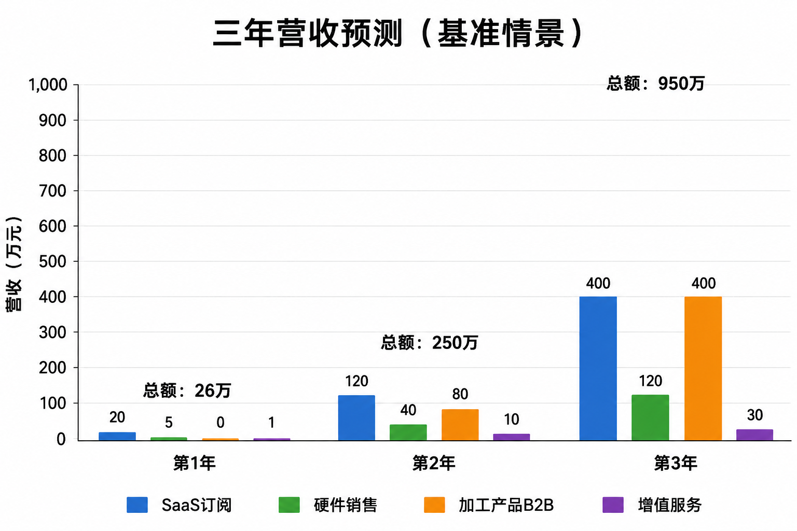

### 8.2 成本结构与盈亏分析

| 成本项目 | 第 1 年 | 第 2 年 | 第 3 年 |
|---------|---------|---------|---------|
| 人员工资 | 80 万 | 130 万 | 180 万 |
| 场地租金 | 10 万 | 18 万 | 30 万 |
| 设备折旧 | 8 万 | 15 万 | 20 万 |
| 硬件制造 | 12 万 | 35 万 | 70 万 |
| 加工原料采购 | 0 万 | 60 万 | 120 万 |
| 营销推广 | 25 万 | 60 万 | 100 万 |
| 云服务/IT | 5 万 | 15 万 | 35 万 |
| 行政/其他 | 8 万 | 20 万 | 40 万 |
| **总成本** | **148 万** | **353 万** | **595 万** |
| **净利润** | **-65.5 万** | **67 万** | **355 万** |

**盈亏平衡点**：预计 **第 2 年 Q4**（第 21 个月）实现整体盈亏平衡。

### 8.3 两条业务线独立盈利分析

| 项目 | Y1 SaaS | Y1 加工 | Y2 SaaS | Y2 加工 | Y3 SaaS | Y3 加工 |
|------|---------|---------|---------|---------|---------|---------|
| 收入 | 82.5 万 | 0 万 | 250 万 | 150 万 | 550 万 | 400 万 |
| 直接成本 | 17 万 | 0 万 | 80 万 | 108 万 | 140 万 | 240 万 |
| 分摊费用 | 68 万 | 15 万 | 100 万 | 45 万 | 140 万 | 75 万 |
| **净利润** | **-2.5 万** | **-15 万** | **70 万** | **-3 万** | **270 万** | **85 万** |
| 毛利率 | 79.4% | — | 68.0% | 28.0% | 74.5% | 40.0% |

> **关键结论**：两条业务线在第 3 年均实现独立盈利。加工业务不是 SaaS 的负担——第 3 年贡献净利润 85 万元（占 24%），形成有效的风险对冲。

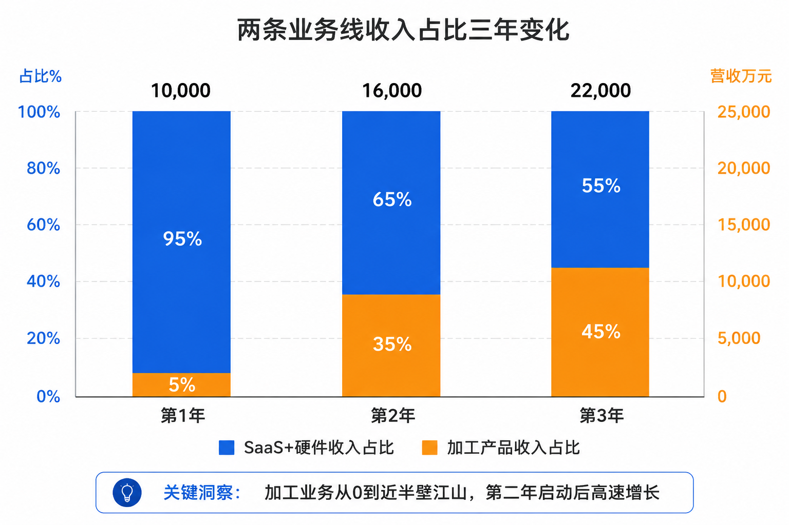

### 8.4 单位经济模型

**CAC（客户获取成本）**：

| 成本项 | Y1 | Y2 | Y3 |
|-------|-----|-----|-----|
| 市场+销售人力 | 20 万 | 40 万 | 60 万 |
| 营销推广费 | 15 万 | 35 万 | 60 万 |
| 渠道佣金（20%） | 1 万 | 7.5 万 | 18 万 |
| 新增客户数 | 50 户 | 150 户 | 300 户 |
| **CAC/户** | **7,200 元** | **5,500 元** | **4,600 元** |

**LTV（客户生命周期价值）**：

| 客户类型 | ARPU/年 | 年留存率 | 平均生命周期 | LTV |
|---------|---------|---------|------------|-----|
| 基础版（纯 SaaS） | 400 元 | 65% | 2.9 年 | 1,160 元 |
| 专业版（全模块） | 1,000 元 | 70% | 3.3 年 | 3,300 元 |
| 基础版+硬件套装 | 3,900 元（首年） | 65% | 2.9 年 | 4,540 元 |
| **加权平均** | **≈ 1,200 元** | **67%** | **3 年** | **≈ 3,600 元** |

**LTV:CAC 健康度**：

| 年份 | CAC | LTV | LTV:CAC | 评估 |
|------|-----|-----|---------|------|
| Y1 | 7,200 | 3,600 | 0.5:1 | 冷启动投入期（正常） |
| Y2 | 5,500 | 3,600 | 0.65:1 | 接近回收线 |
| Y3 | 4,600 | 3,600 | 0.78:1 | 逼近健康线 |
| 稳态目标 | 3,000 | 3,600 | **1.2:1** | Y4–5 目标 |

### 8.5 现金流预测

| 项目 | 第 1 年 | 第 2 年 | 第 3 年 |
|------|---------|---------|---------|
| 期初现金 | 220 万（含融资） | 154.5 万 | 221.5 万 |
| 经营性现金流入 | 82.5 万 | 400 万 | 950 万 |
| 经营性现金流出 | 148 万 | 353 万 | 595 万 |
| 经营性净现金流 | -65.5 万 | +47 万 | +355 万 |
| 期末现金 | **154.5 万** | **201.5 万** | **556.5 万** |

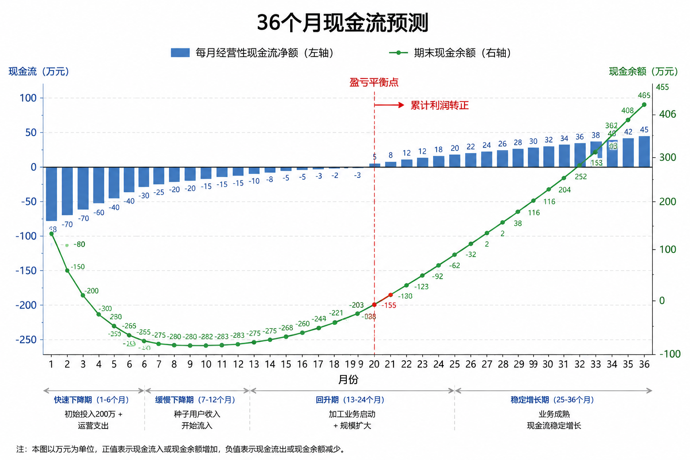

### 8.6 投资人回报测算

| 指标 | 数值 |
|------|------|
| 天使轮投资额 | 200 万元（占股 15%） |
| 第 3 年公司估值（P/S 5x） | 4,750 万元 |
| 天使投资人股权价值 | 712.5 万元 |
| 投资回报倍数（3 年） | **3.6x** |
| 年化 IRR | **≈ 53%** |

### 8.7 收入达成率压力测试

| 场景 | Y2 营收 | Y2 净现金流 | Y2 期末现金 | 可支撑月数 |
|------|---------|------------|------------|-----------|
| 乐观（100% 达成） | 400 万 | +47 万 | 201.5 万 | 6.8 月 |
| 中性（80% 达成） | 320 万 | -20 万 | 134.5 万 | 4.5 月 |
| 保守（60% 达成） | 240 万 | -90 万 | 64.5 万 | 2.2 月 |

> **测试结论**：200 万天使轮的承受底线约为营收偏差 30–40%。当 Y2 Q1–Q2 实际营收与预测偏差 ≥25% 时，启动降本和融资对接。

---

## 九、团队：跨学科是我们的护城河

### 9.1 创始团队

| 成员 | 专业 | 角色 | 核心能力 |
|------|------|------|---------|
| **罗应杰** | 表演 1252（AI 独立开发经验） | CTO 兼 CEO | AI Agent 架构设计、大模型应用开发（RAG/Prompt Engineering）、全栈开发 |
| **黄子格** | 大气科学 1252 | CSO 兼 COO | 气象数据分析、农业气象模型、种植户需求调研与对接 |
| **梁秀娟（指导教师）** | 商业/创业指导 | 导师/顾问 | 商业模式设计、财务规划、融资策略 |

> ⚠️ **待替换：真实团队合照** —— 罗应杰、黄子格、梁秀娟三位团队成员真人照片，背景为广东海洋大学校园或农田。

### 9.2 能力互补：为什么这个组合稀缺

```
        AI 技术               大气科学 + 农业
      （罗应杰）              （黄子格）
           ↘                  ↙
             跨学科交叉壁垒
           （全国唯一此类组合）
                   ↕
           商业指导 + 高校资源
           （梁秀娟 + GDOU）
```

- **大气科学 × AI**：气象预警 Agent 的核心算法理解需要大气动力学知识——这是纯计算机背景团队不具备的能力壁垒
- **表演 × 产品**：沟通表达与用户共情能力 → 种植户需求调研和产品演示的核心竞争力
- **GDOU 产学研**：滨海农业学院 + 海洋与气象学院的科研资源和实验条件直接接入

### 9.3 团队扩张计划

| 阶段 | 时间 | 新增岗位 | 总人数 |
|------|------|---------|--------|
| 种子期 | 第 1–2 月 | — | 2 创始人 |
| 天使轮后 | 第 1 月 | 全栈工程师 1 人 + 硬件工程师 1 人 | 4 人 |
| P2 扩展期 | 第 6–10 月 | 兼职算法工程师 1 人 | 5 人 |
| Y2 起 | 第 13 月+ | 运营专员 1 人 + 销售 1 人 | 6–8 人 |

### 9.4 股权结构

| 股东 | 股权比例 | 出资形式 | 分配依据 |
|------|---------|---------|---------|
| 罗应杰 | 35% | 技术+全职 | AI 技术核心 + 项目发起 |
| 黄子格 | 20% | 全职 | 农业气象领域 + 高校科研对接 |
| 期权池 | 15% | — | 预留核心员工/未来引进人才（4 年归属，1 年 cliff） |
| 天使投资人 | 15% | 现金 200 万 | 本轮投资 |
| 联合创始人预留 | 15% | — | 未来引入 COO/CFO 等核心成员 |

---

## 十、融资需求与里程碑

### 10.1 本轮详情

| 项目 | 内容 |
|------|------|
| **融资金额** | 200 万元 |
| **出让比例** | 10%–15% |
| **投后估值** | 1,500–2,000 万元 |
| **估值方法** | 可比公司法（参照智慧农业 SaaS 早期项目 P/S 3–5x） |
| **资金到账时间** | 公司注册后第 1 个月内 |

### 10.2 资金用途

| 用途 | 金额 | 占比 | 说明 |
|------|------|------|------|
| 技术研发 | 80 万 | 40% | AI 模型训练、平台开发、硬件原型 |
| 市场推广 | 60 万 | 30% | 首批 50 户试点、营销活动、渠道建设 |
| 生产基地 | 40 万 | 20% | 副产品加工中试车间（150 ㎡）、设备采购 |
| 运营储备 | 20 万 | 10% | 日常运营、法务行政 |

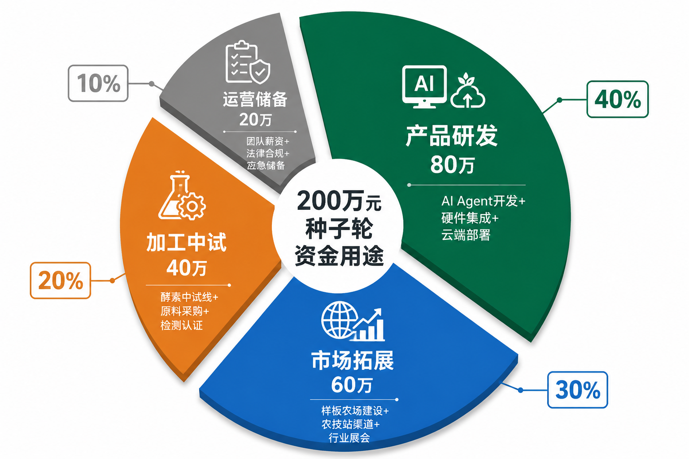

### 10.3 里程碑与下轮融资

| 里程碑 | 目标 | 预期时间 | 下轮融资 |
|--------|------|---------|---------|
| 50 户试点验证 + MVP 稳定运行 | PMF 验证 | 第 12 月 | Pre-A 轮（300–500 万） |
| 年营收破 500 万 + 300 户覆盖 | 规模复制 | 第 24 月 | A 轮（1,000–2,000 万） |
| 年营收破 1,500 万 + 粤西领先 | 区域龙头 | 第 36 月 | B 轮（3,000 万+） |

---

## 十一、风险与退出策略

### 11.1 风险矩阵

| 风险 | 概率 | 影响 | 等级 | 应对 |
|------|------|------|------|------|
| 种植户数字化需求不足 | 中 | 高 | ⭐⭐⭐⭐ | 免费试用+成功案例说服+农资商信任背书 |
| 大厂进入竞争 | 中高 | 中 | ⭐⭐⭐⭐ | 深扎粤西本地化+数据壁垒+排他合作 |
| 资金链断裂 | 中 | 极高 | ⭐⭐⭐⭐⭐ | 多渠道融资+成本控制+12 月现金储备 |
| 核心团队流失 | 中 | 高 | ⭐⭐⭐⭐ | 股权激励+文化建设+备份人员 |
| AI 模型精度不足 | 中 | 中 | ⭐⭐⭐ | 持续迭代+人工兜底机制 |
| 传感器可靠性 | 低 | 高 | ⭐⭐⭐ | 至少 2 家供应商+每月校准 |
| 政策补贴调整 | 低 | 低 | ⭐⭐ | 不依赖补贴，SaaS 现金流自力更生 |

### 11.2 项目终止条件（"关门机制"）

| 触发条件 | 时间节点 | 应对 |
|---------|---------|------|
| Y2 未达 ≥100 户付费用户 | 第 24 月 | 停止 SaaS 独立运营，转型农业科技咨询 |
| 现金余额 < 3 月运营支出且未完成下轮融资 | 随时 | 启动"休眠模式"，保留知识产权 |
| 加工 OEM 连续 12 月亏损 | 第 18 月 | 取消自营产线，转纯贸易模式 |
| 两位创始人同时离队 | 随时 | 清盘或转让给 GDOU 孵化 |

> 设置退出条件不是悲观，是对投资人负责、对团队时间负责。清晰的下限让团队在上限上更大胆。

### 11.3 退出路径

| 路径 | 预期时间 | 预期估值 | 对投资人价值 |
|------|---------|---------|------------|
| **A 轮后并购** | 第 3–5 年 | 5,000 万–1.5 亿 | 大型农业科技公司战略收购 |
| **独立上市** | 第 7–10 年 | 10 亿+ | 北交所/科创板农业科技第一股 |
| **团队回购** | 第 3–5 年 | 按最新估值 | 创始人回购投资人股份 |

---

## 十二、附录

### 附录 A：政策红利清单

| 层级 | 政策 | 扶持力度 |
|------|------|---------|
| 国家 | 十五五规划—农业生产信息化率 2030 年达 35% | 方向性支持 |
| 国家 | 研发费用 100% 加计扣除 | 税收优惠 |
| 广东省 | 智慧农业示范项目补贴 | 最高 300 万/项目 |
| 广东省 | 县域智慧农业补贴基金 | 年投入 5 亿元 |
| 广东省 | 大学生创业无偿资助 | 最高 50 万元 |
| 湛江市 | 创业孵化基地 | 2 年免租金 |
| 湛江市 | 创业担保贷款 | 最高 50 万，政府贴息 50% |
| GDOU | 大学生创业扶持资金 | 1–10 万元 |
| GDOU | 创业孵化基地 | 免费办公场地+网络+水电 |

### 附录 B：知识产权规划

| 类型 | 内容 | 状态 |
|------|------|------|
| 商标 | "海韵智耕"品牌（第 9/35/31/5 类） | 待注册 |
| 软件著作权 | AI Agent 平台 8 大模块 | 开发完成后逐一登记 |
| 发明专利 | 基于气象-土壤联合模型的种植风险预警方法 | 待申请 |
| 发明专利 | 基于改进 YOLOv8 的热带作物病害识别方法 | 待申请 |
| 实用新型 | 传感器阵列结构创新 | 待申请 |

### 附录 C：参考文献与数据来源

| 类型 | 来源 |
|------|------|
| 政策文件 | 《"十四五"全国农业农村信息化发展规划》《广东省数字农业农村发展规划（2023-2027）》《数字中国建设整体布局规划》 |
| 行业报告 | 《广东省农业统计年鉴》《中国智慧农业发展报告》 |
| 学术论文 | 广东海洋大学滨海农业学院相关论文、湛江菠萝产量气象预报模型研究、GA-BP 甘蔗产量预测模型 |
| 统计数据 | 湛江市农业农村局公告、广东省农业农村厅公告 |

### 附录 D：图片索引

| 编号 | 内容 | 建议类型 |
|------|------|---------|
| IMAGE_01 | 项目封面图 | 航拍+科技感叠加 |
| IMAGE_02 | 五道锁链信息图 | 手绘风格信息图 |
| IMAGE_03 | 种植户画像对比 | 摄影+排版 |
| IMAGE_04 | 四层技术架构图 | 技术架构渲染图 |
| IMAGE_05 | 双业务协同图 | 流程图 |
| IMAGE_06 | TAM/SAM/SOM 漏斗 | 数据图表 |
| IMAGE_07 | 三用户画像 | 插画风格 |
| IMAGE_08 | 竞争定位矩阵 | 2×2 矩阵图 |
| IMAGE_09 | 增长飞轮 | 圆形流程图 |
| IMAGE_10 | 产品迭代时间线 | 时间轴 |
| IMAGE_11 | 三年收入柱状图 | 数据图表 |
| IMAGE_12 | 双业务收入占比变化 | 堆叠图 |
| IMAGE_13 | 现金流预测曲线 | 柱状+折线图 |
| IMAGE_14 | 团队照片 | 人物摄影 |
| IMAGE_15 | 资金用途饼图 | 饼图 |

---

> **海韵智耕创业团队**
> 罗应杰（表演1252）· 黄子格（大气1252）
> 指导教师：梁秀娟
> 广东海洋大学 · 创业基础课程
> 2026 年 4 月

> 📝 大纲版详见 [OUTLINE.md](./OUTLINE.md)，含课程章节对应、完整 SWOT 分析、创业者素质模型等学术框架内容。
