# 海韵智耕 — 商业计划书

**广东海洋大学 · 海韵智耕创业团队**

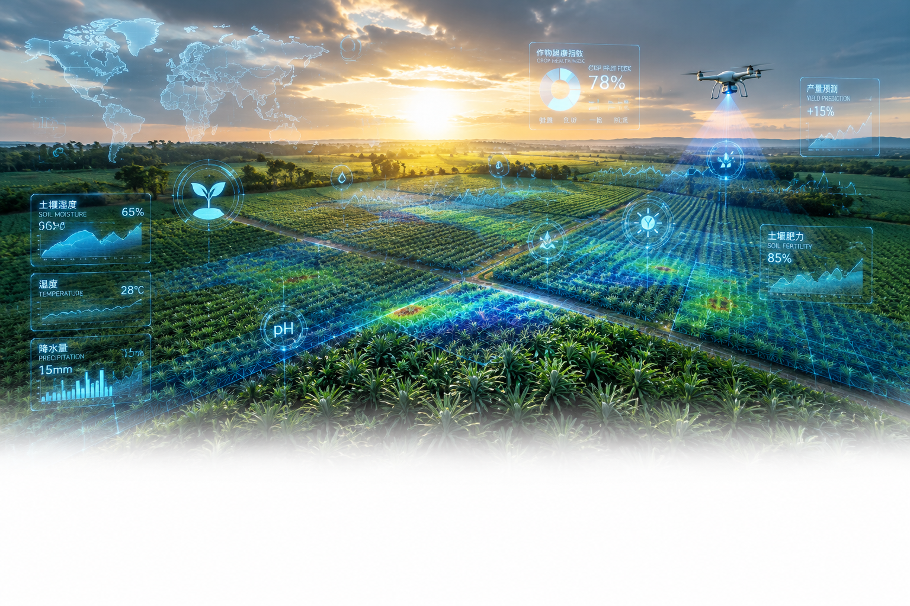

**目  录**

1. 执行总结
2. 项目背景
3. 市场机会
4. 公司战略
5. 市场营销
6. 生产管理
7. 投资分析
8. 财务分析
9. 管理体系
10. 机遇与风险
11. 风险资本的退出
附录一：前期调研报告
附录二：核心技术

## 1. 执行总结

湛江海韵智耕科技有限公司秉承"用 AI 守护每一寸土地，用科技激活每一份资源"的经营理念，致力于将人工智能应用于热带作物种植场景。公司目前持有的"基于多模态感知的 AI Agent 智慧农场管理系统"由广东海洋大学大气科学系与计算机学院联合研发，拥有完全自主知识产权，核心算法已申请国家发明专利。

海韵智耕以"AI Agent 智慧农场 SaaS + 农产品副产品深加工"双轮驱动切入智慧农业市场。公司首期推出八大 AI Agent 模块，MVP 阶段聚焦气象灾害预警与土壤墒情监测两大核心功能，帮助种植户从"靠天吃饭"转型为"知天而作"。同时，公司针对菠萝皮渣、甘蔗秸秆等大量被废弃的农产品副产品，开发酵素、果酒、生物质复合材料等高附加值产品，实现废弃物 20—30 倍的增值转化。

我国智慧农业市场规模已突破千亿元，年增长率保持在 18% 以上。但现有方案普遍偏重硬件自动化，缺乏面向热带作物种植场景的 AI 决策能力。海韵智耕以"全国唯一大气科学 × 热带农业 × AI 跨学科创业团队"为核心壁垒，切入粤西这一最具代表性的热带作物产区。

海韵智耕首先聚焦粤西三市——湛江、茂名、阳江。这里的热带作物种植面积超过 300 万亩，年产值超过 200 亿元。湛江徐闻县是全国最大的菠萝生产基地，年种植面积约 35 万亩，产量占全国三分之一以上；雷州半岛芒果种植面积超过 20 万亩；遂溪县甘蔗种植面积约 40 万亩，是广东最大的糖蔗生产基地。在市场拓展路径上，初期以粤西为核心根据地，优先覆盖 500 亩以上的规模种植户和农业合作社；随后向海南、广西、云南等热带作物产区辐射；中长期通过"一带一路"农业合作渠道进入东南亚市场。

核心产品为"耕云 AI Agent 智慧农场管理平台"，采用 SaaS 订阅模式，按种植面积收取年费。基础版年费 400 元/亩（气象预警 + 土壤墒情监测），专业版 800 元/亩（增加病虫害预警 + 水肥决策），企业版 1,200 元/亩（全模块 + API 对接）。配套硬件包括多模态感知终端，一次性部署成本约 200 元/亩。副产品深加工板块首期建设年处理 5,000 吨原料的中试生产线，选址湛江市麻章区，主要产品包括菠萝皮渣酵素饲料添加剂、芒果皮果酒、甘蔗秸秆生物质复合材料，采用 B2B 订单模式。

营销上采取"免费试用 + 效果驱动付费"的冷启动策略。第一年选取 5—8 个标杆种植户免费部署全套系统，通过产量对比形成案例说服力；同时与湛江市农业农村局、徐闻县菠萝协会、雷州芒果合作社等建立合作关系，通过行业会议和田间示范会推广。第一年目标覆盖 500 亩，第二年 2,000 亩，第三年 8,000 亩。

公司注册资本 300 万元人民币。外来风险投资入股 200 万（66.7%），团队技术入股 60 万（20%），团队资金入股 40 万（13.3%）。公司成立初期需资金 280 万元，其中风险投资 200 万元，团队自筹 50 万元，流动资金贷款 30 万元。预计第二年开始盈利，第三年营收达到 950 万元，净利润约 326 万元。内部收益率约 50%，投资净现值 312 万元（折现率 12%）。风险投资可通过分红和股权转让收回投资，预计第三年末回报倍数约 3.6 倍。

公司初期采用直线型组织结构，总经理直接向董事会负责。创业团队核心成员来自广东海洋大学大气科学、计算机科学和水产学院，分别在气象数据分析、AI 算法开发、热带作物种植管理领域具有扎实的专业知识。指导教师梁秀娟副教授长期从事创新创业教育与企业战略研究。此外，团队聘请了湛江市农业科学研究院两位高级农艺师担任技术顾问。

## 2. 项目背景

据国家统计局和农业农村部数据，我国智慧农业市场规模在 2025 年已突破 1,200 亿元，年复合增长率保持在 18% 以上。然而这一增长主要由硬件设备驱动——无人机植保、智能灌溉设备、农业传感器。真正面向种植决策的 AI 软件服务，渗透率不足 5%。

在热带作物种植领域，这个空白更触目惊心。全国热带作物种植面积超过 6,000 万亩，但没有任何一款 AI 决策产品专门针对热带种植场景做过适配。没有。

粤西地区是全国最大的热带作物产区之一。湛江、茂名、阳江三市年产菠萝约 100 万吨（占全国三分之一）、芒果约 30 万吨、甘蔗约 200 万吨、荔枝和香蕉各约 20 万吨。但与产业规模形成刺眼对比的是数字化水平的严重滞后。据团队 2025 年 12 月至 2026 年 2 月在徐闻、雷州、遂溪三地的实地调研，种植户中智能水肥一体化设备的渗透率不足 20%，使用任何形式数字化种植管理工具的比例低于 10%。

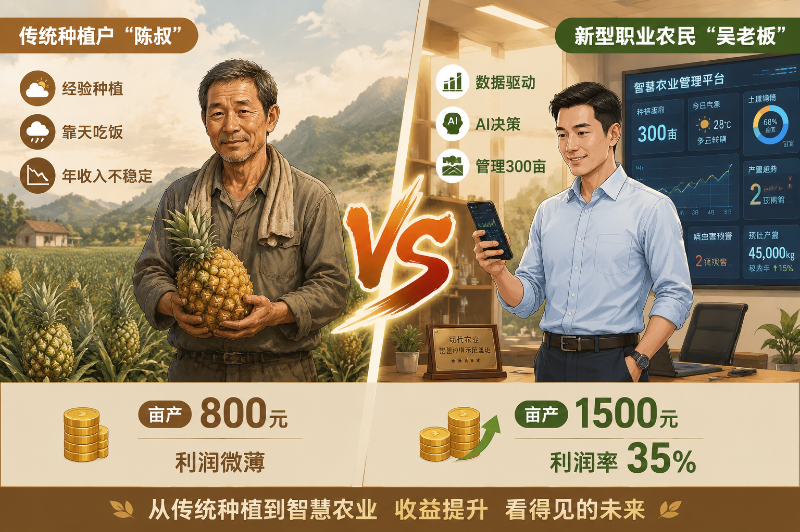

副产品浪费问题同样惊人。菠萝加工产生的皮渣占原料重量 40%—50%，芒果皮核占 30%—40%，甘蔗秸秆占 50%—60%。这些副产品绝大多数被填埋或露天焚烧。据估算，仅湛江一市，每年因此造成的潜在经济损失就超过 10 亿元。

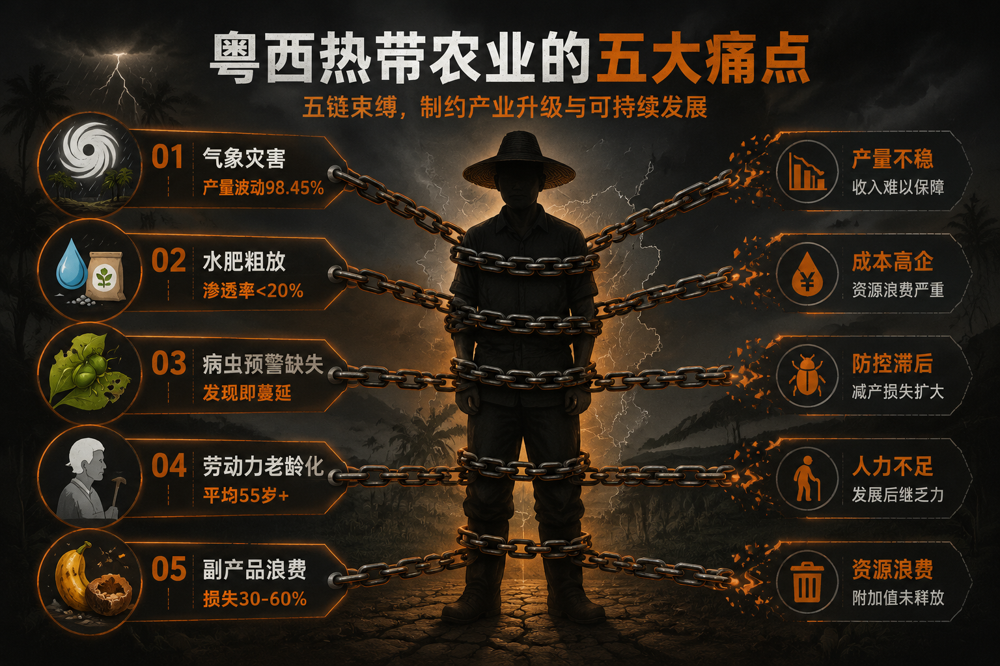

政策面正在快速转暖。2025 年中央一号文件明确提出"推进智慧农业发展"，农业农村部随后将 AI 种植决策列为重点支持方向。广东省"百县千镇万村高质量发展工程"将数字农业作为粤西振兴的核心抓手。湛江市《数字湛江发展规划》明确支持农业 AI 创新创业。这对海韵智耕意味着一个极为有利的窗口期。

耕云 AI Agent 智慧农场管理平台由四个技术层级构成。感知层部署于田间的多模态感知终端，集成土壤温湿度传感器、土壤电导率传感器、空气温湿度传感器、光照强度传感器、降雨量传感器和虫情监测灯，单套终端覆盖 10—15 亩，数据采集频率每 10 分钟一次，通过 4G Cat.1 网络上传云端。数据层通过云端数据中台接入多源数据——田间感知终端实时数据、中国气象局 CMA 数值预报产品（ECMWF 和 GFS 全球模式降尺度到 1km 分辨率）、湛江市农业农村局土壤普查数据、以及团队自建的粤西热带作物病虫害知识图谱。AI Agent 层是平台核心，由八大专业 Agent 组成——气象灾害预警、土壤墒情分析、病虫害预测、水肥决策、产量预估、农事排程、市场价格预测和碳汇核算，每个 Agent 独立运行，通过消息总线协同，最终以自然语言和可视化图表向种植户输出决策建议。应用层为微信小程序加 Web 管理后台，种植户通过小程序接收每日农事建议——比如"未来 48 小时有暴雨风险，建议今日完成排水沟清理"——同时查看田间实时数据和历史趋势。

平台 MVP 版本已于 2026 年 3 月完成内测，在广东海洋大学校内试验田（5 亩菠萝种植区）进行了三个月验证运行：气象预警准确率 87%，土壤墒情预测误差小于 5%。

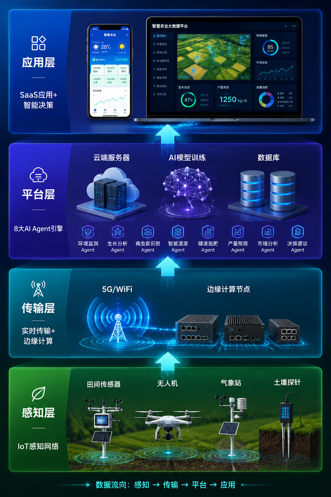

副产品深加工方面，三条产品线各有明确技术路径。菠萝皮渣酵素饲料添加剂，以菠萝加工废弃皮渣为原料，通过复合菌种（乳酸菌 + 酵母菌 + 芽孢杆菌）三段式厌氧发酵工艺，每吨菠萝皮渣可生产约 200 公斤酵素添加剂，市场售价约 8,000 元/吨，面向粤西及广西的养殖企业。芒果皮果酒以芒果加工废弃果皮和残次果为原料，低温发酵酿造（酒精度 8%—12% vol），定价 38—58 元/瓶（375ml），定位年轻消费群体的佐餐果酒。甘蔗秸秆生物质复合材料以甘蔗秸秆纤维为增强相，回收聚丙烯为基体，模压成型生产建筑模板和物流托盘，产品强度达到木模板的 85%，成本仅为木模板的 50%，可循环使用 20 次以上。

产品层次从核心利益到潜在产品共五层：核心利益是让种植户从"靠经验决策"升级为"靠数据决策"；有形产品是耕云平台（SaaS + 感知硬件）；期望产品是覆盖全品类的热带作物 AI 种植决策系统；扩张产品是接入金融、保险、农资、销售的一站式农业服务平台；潜在产品是面向全球热带作物产区的 AI 种植知识库。

研发路线上，短期（1—2 年）已完成的 MVP 版本核心功能包括气象灾害预警 Agent（基于 CMA 数值预报产品的降尺度模型）和土壤墒情监测 Agent（基于多源土壤传感器数据融合算法），下一阶段重点开发病虫害预测 Agent（基于计算机视觉的虫害识别）和水肥决策 Agent（基于作物生长模型的 NPK 优化算法），并完成芒果、荔枝、甘蔗三种作物的模型适配。中长期（3—5 年）正在开展基于多光谱无人机影像的作物长势评估研究，以及基于强化学习的温室环境自动控制算法研究，同时计划将核心模型从热带作物扩展到温带作物。副产品深加工方面，正在进行菠萝皮渣中菠萝蛋白酶提取工艺的实验室研究——该酶在食品和医药领域应用前景广阔，市场价值远高于酵素饲料添加剂。

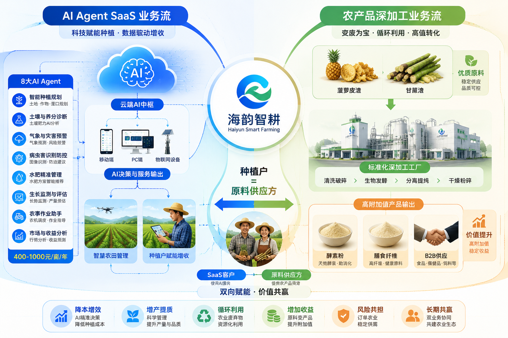

## 3. 市场机会

以上是耕云平台能做什么。但产品能做什么和用户愿意为什么付费，是两回事。要回答后一个问题，必须到田里去问。

耕云的市场定位清晰而狭窄：热带作物 AI 种植决策这一空白利基。基于前期市场调研（详见附录一），市场分为三个圈层。

第一圈层，粤西本地。湛江、茂名、阳江三市，500 亩以上的规模种植户约 600 户，农业合作社约 1,200 家，农业龙头企业约 80 家。他们是数字化意愿最强、支付能力最高的群体。以每户年均 SaaS 支出 3—8 万元计算，粤西本地市场年规模约为 5,000—8,000 万元。

第二圈层，华南热带作物产区。海南全省（热带作物种植约 800 万亩）、广西南部（南宁、崇左、钦州等，约 500 万亩）、云南西双版纳和德宏（约 200 万亩）。这些地区的气候条件和作物品种与粤西高度相似，耕云的核心模型几乎可以直接复用。第二圈层年市场规模约 3—5 亿元。

第三圈层，全国及海外。东南亚四个国家——泰国、越南、菲律宾、印度尼西亚——热带作物种植面积合计超过 3,000 万亩，是粤西的十倍以上。仅泰国菠萝种植面积就超过 100 万亩。进入第三圈层需要解决语言本地化、气候模型适配和跨国运营的法律合规问题，计划第五年启动东南亚试点。

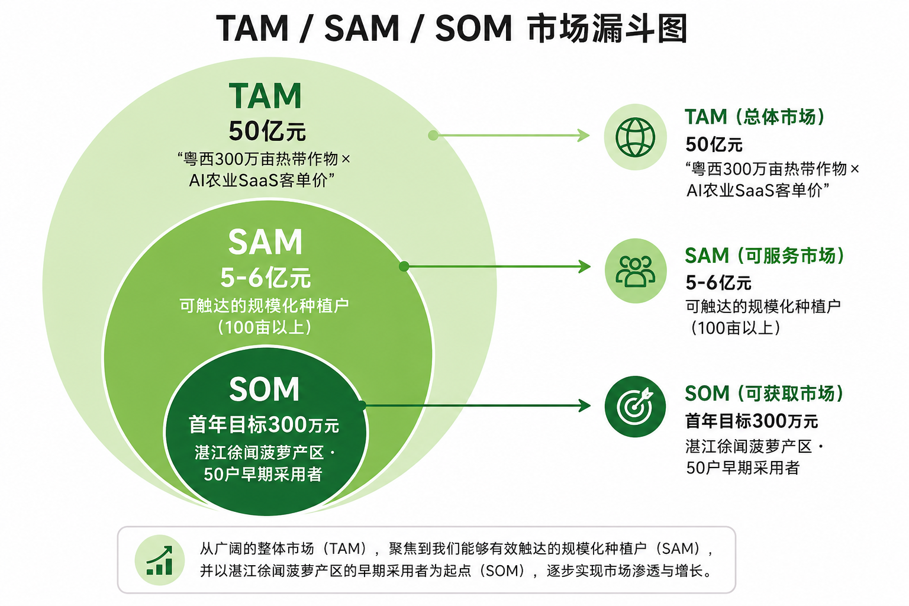

前期调研揭示了三个至关重要的顾客购买准则。

压倒一切的第一决策因素是可验证的增产效果。调研中 90% 的受访种植户表示，如果看到同行的使用数据和增产案例，就会愿意付费。这与消费品领域"看广告再购买"的逻辑完全不同——农业是高度理性的投入决策场景，每一分钱投入都直接影响当年收成。所以"免费试用 + 标杆案例 + 数据说话"是唯一有效的市场进入路径。"广告轰炸"模式在农业领域基本无效。

使用门槛对 55 岁以上的种植户来说，比价格更重要。他们担心"会不会用"甚于"贵不贵"。这要求产品前端体验必须极致简洁：微信小程序界面、语音播报农事建议（粤语/普通话双语）、一键呼叫人工客服。"打开手机就能看懂"是产品设计的第一准则。

信任来源不是广告，是熟人推荐和权威机构背书。一个农技站技术员的推荐，抵得过十次广告投放。因此与当地农业农村局、农技推广站、行业协会的合作是生命线。价格方面，种植户对 SaaS 年费可接受范围 300—1,200 元/亩，中位数 600 元/亩。值得注意的是，35 岁以下种植户的价格接受上限显著高于 55 岁以上群体——随着代际更替，付费意愿将自然走高。

市场渗透的节奏与上述购买准则紧密对应。

第一年聚焦徐闻和雷州。选取 5—8 个标杆种植户免费部署全套耕云系统，通过一个完整种植季的数据采集和效果对比形成案例。同时与湛江市农业农村局、徐闻菠萝协会建立合作关系，举办 3—5 场田间示范会。年末实现付费用户 15—20 户，SaaS 收入约 25 万元，硬件约 10 万元。加工板块完成中试线建设，首批酵素添加剂送样检测。

第二年标杆案例支撑下向粤西三市全面推广，通过农技推广站网络触达规模种植户。年末付费用户 80—100 户，覆盖约 2,000 亩，SaaS 收入约 120 万元，硬件约 40 万元。加工板块正式投产，酵素添加剂销售额约 80 万元。全年总收入约 240 万元。

第三年品牌效应显现。付费用户快速增长至 300—400 户，覆盖约 8,000 亩，SaaS 收入约 560 万元，硬件约 120 万元。加工板块放量：酵素添加剂 150 万元、果酒 80 万元、复合材料 40 万元。全年总收入约 950 万元，实现盈亏平衡并开始盈利。第四至五年进入海南和广西市场，付费用户突破 1,000 户，覆盖超过 30,000 亩，全年总收入预计超 3,000 万元。

市场规模诱人，但为什么是海韵智耕来做？用波特的五力模型审视竞争格局，答案清晰。

现有竞争者主要是大疆农业、极飞科技、丰疆智能等硬件自动化厂商，产品定位在设备互联层面，缺乏面向种植决策的 AI 能力。更关键的是，这些厂商的产品均为通用型方案。以大疆农业为例，其病虫害识别模型训练数据主要来自水稻、小麦等大田作物，对菠萝心腐病、芒果炭疽病等热带特有病害的识别准确率不足 60%。海韵智耕的三个"唯一"构筑了差异化壁垒：唯一深度整合气象科学、热带作物学和 AI 技术的团队，唯一专门面向热带种植场景的决策系统，唯一将种植 SaaS 与副产品深加工打通的商业模式。

供应商方面，云计算资源和传感器组件市场供应充分、竞争充分。气象数据主要使用 CMA 公开发布的数值预报产品，不受单一供应商制约。加工板块原料——菠萝皮渣、甘蔗秸秆——目前被当作废弃物处理，供应商不具备议价能力。

顾客方面，由于市场上尚无直接竞品，早期采用者选择空间有限。且随着种植户将全年农事数据沉淀在耕云平台上、习惯每日 AI 建议的工作流，转换成本将显著增加。

潜在竞争者有三类。互联网大厂（阿里云农业大脑、腾讯 AI 农业），资金充裕但缺乏垂直场景专注度。传统农业信息化企业（托普云农、慧云信息），渠道广泛但 AI 能力不足。农业科研院所孵化项目（中国热科院、华南农大），专业深厚但商业化和产品化能力弱。海韵智耕的应对：快速建立"热带作物 AI = 耕云"的用户心智；通过持续数据积累构建壁垒——每增加一个用户、一个种植季的数据，都在增强模型的不可替代性；与广东海洋大学保持紧密的产学研合作。

替代品方面，传统农技推广服务（农业局技术员下乡）免费且有官方背书，但服务频次极低——粤西每万名种植户仅配备 3—5 名农技人员。微信群和快手上的"农业网红"扮演了一定角色，但其信息的准确性和个性化程度无法与 AI 系统相比。

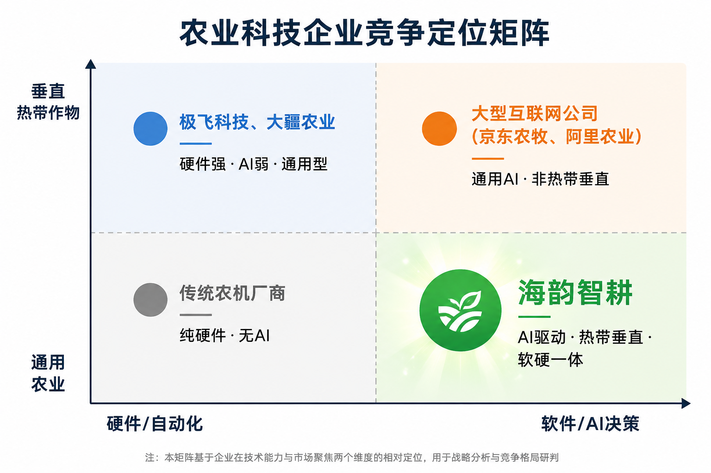

## 4. 公司战略

竞争格局清楚了，战略选择也就明确了——不是与硬件厂商比设备，不是与大厂比资金，而是把热带作物 AI 决策这一个点打透。

湛江海韵智耕科技有限公司于 2026 年在湛江市注册成立，注册资本 300 万元，总部设在麻章区广东海洋大学科技园内。公司使命：为热带作物种植者提供可信赖的 AI 决策伙伴，让每寸土地都得到最科学的照料。公司宗旨：将 AI 前沿技术实用化，解决热带作物种植中最紧迫的痛点——气象灾害、水肥管理、病虫害防治。AI 不该只存在于实验室和科技巨头的发布会中，它应该走进田间地头，成为每位种植户触手可及的工具。

发展战略分三期。

初期（1—3 年），主要产品为耕云平台 SaaS，定位为面向热带作物规模种植户的 AI 种植决策工具，占领市场空白。第一年产品正式推向市场，以免费试用模式获取粤西首批标杆用户，完成 5—8 个标杆种植户的完整种植季数据采集，进入徐闻县（菠萝核心产区）和雷州市（芒果核心产区），年末 SaaS 付费面积 500 亩，加工板块完成中试线建设。第二年基于标杆案例扩大覆盖，进入茂名、阳江市场，产品升级 V2.0（新增病虫害预警和水肥决策模块），年末 SaaS 付费面积 2,000 亩，全年总收入约 240 万元。第三年品牌效应显现，产品升级 V3.0（全品类热带作物模型覆盖），进入海南市场试点，年末 SaaS 付费面积 8,000 亩，全年总收入约 950 万元，实现盈亏平衡，启动 Pre-A 轮融资。

中期（4—6 年），八大 AI Agent 模块全部稳定运行，热带作物模型覆盖 15 种以上，市场覆盖华南全部热带作物主产区，启动东南亚试点（首选泰国菠萝产区），加工板块推出菠萝蛋白酶、芒果多酚等高附加值产品，年营收突破 5,000 万元。

长期（7—10 年），纵向延伸至种苗选育 AI 辅助和农产品分级 AI 服务，横向将核心 AI 能力拓展至水稻、小麦、玉米等温带作物，以东南亚为跳板逐步进入南亚、非洲和拉美的热带作物产区。

国际化动因来自三个维度。成本维度：耕云平台的边际服务成本极低——每增加一个用户，主要增量成本是云计算资源，约占 SaaS 收入的 15%——进入国际市场可大幅摊薄前期研发投入。市场维度：东南亚四国热带作物种植面积合计超过 3,000 万亩，且数字化水平普遍低于中国。数据维度：进入不同气候带可以丰富模型训练数据，提升泛化能力。进入方式分两步走：第五年起采取战略联盟方式，与东南亚本地农业科技企业合作，以 SaaS 授权模式进入，合作伙伴负责本地化运营，海韵智耕提供核心 AI 技术；第七年起在核心市场设立海外合资公司，逐步实现本地化。

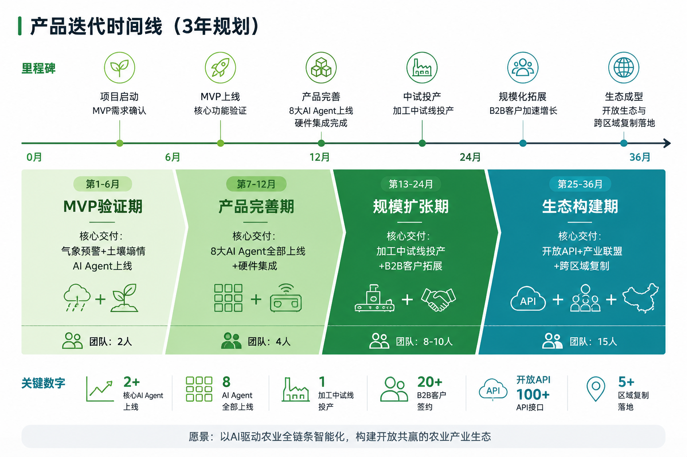

## 5. 市场营销

战略决定了方向，营销回答的是怎么把产品送到种植户手里——在农业领域，这件事的逻辑和城市消费品完全不同。

耕云平台的目标客户是高度理性的生产经营者，不是冲动型消费者。销售策略的核心不是感性营销，而是"用数据说话"的理性说服。初期以直销为主，创始团队直接对接标杆种植户和合作社，通过田间地头的产品演示和效果验证建立信任。中长期建立渠道代理网络，与农资经销商、农机销售商、农技推广站合作。副产品板块采取 B2B 订单模式，直接对接饲料厂、果酒经销商和建材企业。

| 时期 | SaaS 付费面积 | SaaS 收入 | 硬件收入 | 加工收入 | 总收入 |
|------|-------------|----------|---------|---------|-------|
| 第一年 | 500 亩 | 25 万 | 10 万 | 5 万 | 40 万 |
| 第二年 | 2,000 亩 | 120 万 | 40 万 | 80 万 | 240 万 |
| 第三年 | 8,000 亩 | 560 万 | 120 万 | 270 万 | 950 万 |

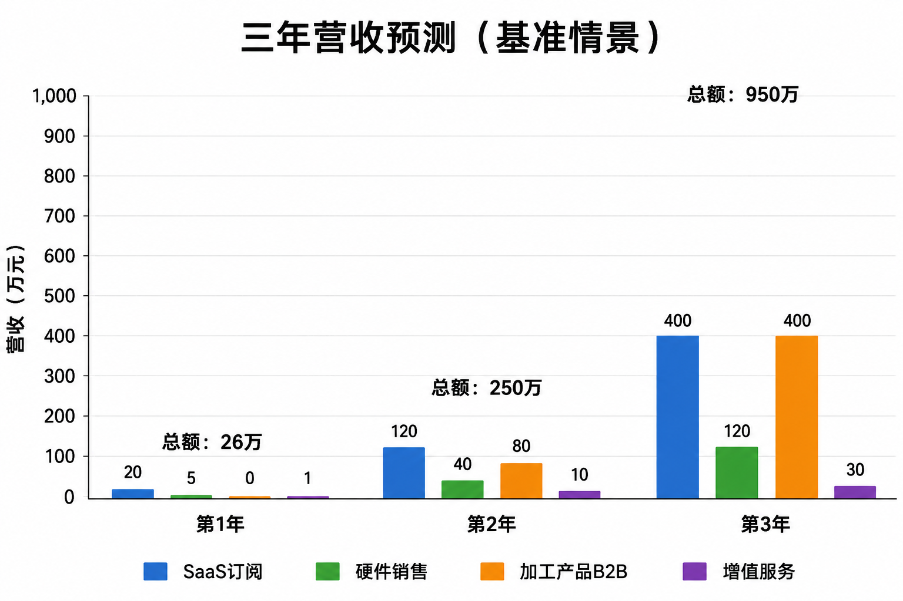

耕云平台按价值导向定价，而非成本加成。以菠萝种植为例：粤西菠萝平均亩产约 2,500 公斤，收购价约 2.0 元/公斤，亩产值约 5,000 元。通过气象预警降低灾害损失 15%（约 750 元/亩），水肥优化降低投入成本 15%—20%（约 200 元/亩），病虫害早预警减少农药和产量损失（约 300 元/亩），合计每亩新增收益约 1,250 元。基础版年费 400 元/亩，仅为新增收益的三分之一。版本梯度：基础版 400 元/亩/年（气象预警 + 土壤墒情），专业版 800 元/亩/年（增加病虫害预警 + 水肥决策），企业版 1,200 元/亩/年（全模块 + API）。首个种植季标杆用户 100% 费用减免。合作社和联合体（500 亩以上）享 20%—30% 批量折扣。硬件终端按成本价销售（约 200 元/亩一次性部署），不追求硬件利润，目的是降低使用门槛并确保数据采集质量。

农业领域的信任逻辑是"信任靠熟人、决策看邻里"。渠道策略围绕这个逻辑展开。与农业主管部门合作是第一抓手——与湛江市农业农村局、徐闻县农业农村局、雷州市农业农村局建立合作关系，通过农技推广站和新型职业农民培训触达目标用户。与行业协会的合作同样关键：徐闻县菠萝协会、雷州芒果协会、湛江市农业产业化龙头企业协会——它们的理事单位通常是当地最有影响力的规模种植户，他们的采用对周边中小种植户具有极强的示范效应。农资经销商是种植户最频繁接触的商业触点：选择粤西规模较大的农资经销商（湛江农资公司、雷州农丰农资经营部），在店面设置展示体验区，经销商每成功推荐一个付费用户，获首年 SaaS 费用的 15%—20% 作为佣金。

直销方面，创始团队初期承担主要销售工作。CEO 罗应杰对接农业主管部门和行业协会，COO 黄子格对接种植户和合作社。两人均为湛江本地人，熟悉粤西方言（粤语、雷州话）和农业圈子，能以"本地人 + 大学生 + 技术专家"的复合身份获得信任。第二年起组建 3—5 人专职销售团队，优先招聘粤西本地农业院校毕业生。线上以微信小程序为主要载体，同时运营公众号和视频号，定期发布粤西气象农事提醒、标杆用户案例故事和 AI 种植小课堂。在抖音和快手开设"粤西阿杰教种地"账号，让种植户刷手机时"偶然"刷到耕云，完成从"这什么东西"到"隔壁村老王也在用"的心智转化。

初期资金有限，避开昂贵的电视和报纸，走精准推广路线。免费试用计划：第一年选取 5—8 个标杆种植户免费提供全套系统，每周至少一次上门巡检，条件是允许采集和使用种植数据（脱敏后），允许在推广中使用对比数据——"陈叔的菠萝田用耕云后，产量提升了 23%"。该计划年度成本约 20 万元，是获取标杆案例最高效的投入。田间示范会：每个种植季前后在标杆用户田间举办 1—2 场，邀请周边种植户现场参观，核心设计理念是"让用户说服用户"——团队只做客观数据展示，标杆用户讲切身感受。每场预算 5,000—8,000 元，预计到场 30—50 名种植户。应急响应服务承诺：台风预警发布后 1 小时内电话通知到户，暴雨红色预警 30 分钟内通知到户。"那些大学生在台风来之前专门打电话提醒我清沟"——这种话在村里传起来，比任何广告都管用。

长期来看，站稳脚跟后逐步扩大投入。在《中国农业信息》《智慧农业》等行业期刊发表技术文章，积极参与热带作物智慧种植的标准制定，冠名赞助"粤西最美菠萝园"等行业评选——这类活动成本不高，但在种植户群体中传播效果极好。

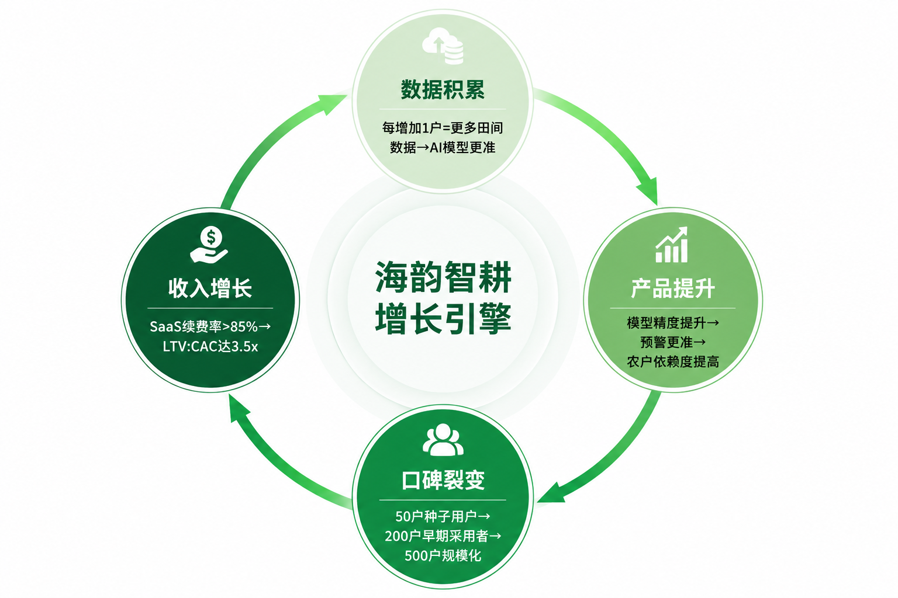

## 6. 生产管理

营销把客户带进门，产品和服务能不能留住他们，取决于生产端的扎实程度。

公司总部及研发中心设在湛江市麻章区广东海洋大学科技园内。选址理由有三。产学研协同：科技园为入驻企业提供优惠办公场地（在校生创业前两年免租金）、共享实验设备和公共技术平台，团队可以便利利用学校的大气科学实验室、计算机集群和农业试验基地。人才获取：广东海洋大学每年计算机、大气科学、农学等相关专业毕业生超 1,000 人，相当比例来自粤西本地、愿留湛江发展。政策支持：科技园提供工商注册、税务申报、知识产权申请等一站式服务，湛江市对数字农业创新创业项目提供专项补贴。

加工中试生产线选址麻章区工业园，距学校约 3 公里，租赁标准厂房约 500 平方米。厂房租金约 12 元/平方米·月，年租金约 7.2 万元。厂区分为四部分：原料预处理区（100 平方米）、发酵与酿造区（200 平方米，酵素发酵罐 3 吨 × 6 台、果酒发酵罐 1 吨 × 4 台）、后处理与包装区（100 平方米）、原料与成品仓储区（100 平方米）。

三条产品线的工艺流程各有技术要点。菠萝皮渣酵素饲料添加剂：菠萝加工厂收集皮渣 → 清洗去杂 → 粉碎打浆（粒径 ≤ 2mm）→ 接入复合菌种（乳酸菌:酵母菌:芽孢杆菌 = 2:1:1）→ 厌氧发酵（35±2℃，72h）→ 固液分离 → 低温干燥（≤ 50℃，含水率 ≤ 12%）→ 粉碎过筛（80 目）→ 包装入库。发酵是品质控制关键环节，团队与广东海洋大学食品科学与工程学院合作优化了菌种配比和发酵参数，确保产品乳酸菌活菌数 ≥ 1×10⁸ CFU/g，有机酸含量 ≥ 8%。

芒果皮果酒：芒果加工厂收集果皮及残次果 → 清洗 → 打浆 → 调糖（至 20°Brix）→ 接入果酒酵母 → 低温发酵（18—22℃，7—10 天）→ 倒罐去酒泥 → 陈酿（≥ 3 个月）→ 澄清过滤 → 灌装 → 巴氏杀菌 → 贴标包装。

甘蔗秸秆生物质复合材料：甘蔗秸秆收集 → 烘干（含水率 ≤ 10%）→ 粉碎（粒径 2—5mm）→ 碱处理（5% NaOH，常温浸泡 4h）→ 水洗至中性 → 烘干 → 与回收聚丙烯按 40:60 比例混合 → 双螺杆挤出造粒 → 模压成型（180±5℃，15MPa，10min）→ 冷却脱模 → 修边 → 成品。

主要设备：

| 设备 | 规格/型号 | 数量 | 单价（万元） | 用途 |
|------|----------|------|------------|------|
| 不锈钢发酵罐 | 3 吨，带温控夹套 | 6 台 | 1.5 | 酵素厌氧发酵 |
| 不锈钢发酵罐 | 1 吨，带温控 | 4 台 | 0.8 | 果酒发酵 |
| 粉碎打浆机 | 500kg/h | 1 台 | 2.0 | 原料预处理 |
| 板框压滤机 | 20 平方米过滤面积 | 1 台 | 1.5 | 固液分离 |
| 低温烘干机 | 50kg/批 | 1 台 | 3.0 | 酵素干燥 |
| 万能粉碎机 | 100kg/h | 1 台 | 0.8 | 酵素粉碎 |
| 灌装封口机 | 半自动 | 1 台 | 1.0 | 果酒灌装 |
| 双螺杆挤出机 | 65 型 | 1 台 | 8.0 | 复合材料造粒 |
| 模压成型机 | 500 吨 | 1 台 | 10.0 | 复合材料成型 |

设备总投资约 35 万元。初期配置 8 人：生产主管 1 名，操作工 5 名（原料预处理 1 人、发酵 1 人、后处理 1 人、复合材料 2 人），仓管兼质检 1 名。

产品包装与运输方面，耕云平台 SaaS 无需物理包装，硬件终端采用防潮防尘工业包装，单箱装 10 套，由顺丰或德邦物流配送，公司技术人员上门安装。酵素饲料添加剂内包装为食品级 PE 密封袋（25kg/袋），外包装编织袋，印刷品名、规格、生产日期、保质期（12 个月）、使用方法。芒果果酒采用 375ml 透明玻璃瓶，铝制螺旋盖，6 瓶/箱，泡沫内衬防震，电商快递或经销商物流。生物质复合材料：建筑模板 1,830mm × 915mm × 15mm，10 块/捆，缠绕膜包装；物流托盘标准尺寸 1,200mm × 1,000mm，裸装，第三方物流配送。

## 7. 投资分析

生产线和设备清楚了，接下来的问题是：需要多少钱，怎么花，值不值得投。

公司注册资本 300 万元。

| 股东 | 出资方式 | 出资金额 | 持股比例 |
|------|---------|---------|---------|
| 风险投资方 | 现金 | 200 万元 | 66.7% |
| 创业团队（技术） | 专利及软件著作权 | 60 万元 | 20.0% |
| 创业团队（资金） | 现金 | 40 万元 | 13.3% |

团队技术入股占 20%，符合国家高新技术企业技术入股相关规定。风险投资方为控股股东，但通过一致行动人协议约定日常经营决策由创始团队负责。公司成立初期共筹集资金 280 万元，其中风险投资 200 万元，团队自筹 50 万元，短期借款 30 万元（金融机构一年期，利率 5.85%）。第 2、3 年将根据需要增加 50—100 万短期借款，改善现金流动并达到合理资产负债比。

资金用途：

| 用途 | 金额 | 占比 |
|------|------|------|
| 研发投入（AI 模型迭代、人员薪酬） | 112 万元 | 40% |
| 市场开拓（标杆用户部署、推广活动） | 84 万元 | 30% |
| 加工中试线建设（设备、厂房） | 56 万元 | 20% |
| 运营储备 | 28 万元 | 10% |
| **合计** | **280 万元** | **100%** |

研发投入 112 万的明细：AI 工程师薪酬（3 人 × 15 万/年 = 45 万）、前后端开发（2 人 × 12 万 = 24 万）、农业数据分析师（2 人 × 10 万 = 20 万）、云计算及数据采购（15 万）、硬件原型及测试（8 万）。市场开拓 84 万：标杆用户免费部署（20 万）、田间示范会及行业会议（15 万）、销售人员薪酬（2 人 × 10 万 = 20 万）、差旅及交通（12 万）、宣传物料（10 万）、渠道合作（7 万）。加工中试线 56 万：设备采购及安装（35 万）、厂房租金（7.2 万/年）、原料采购及试产（10 万）、质检及认证（3.8 万）。运营储备 28 万：公司注册及法务（3 万）、知识产权申请（5 万）、办公及日常运营（12 万）、不可预见费（8 万）。

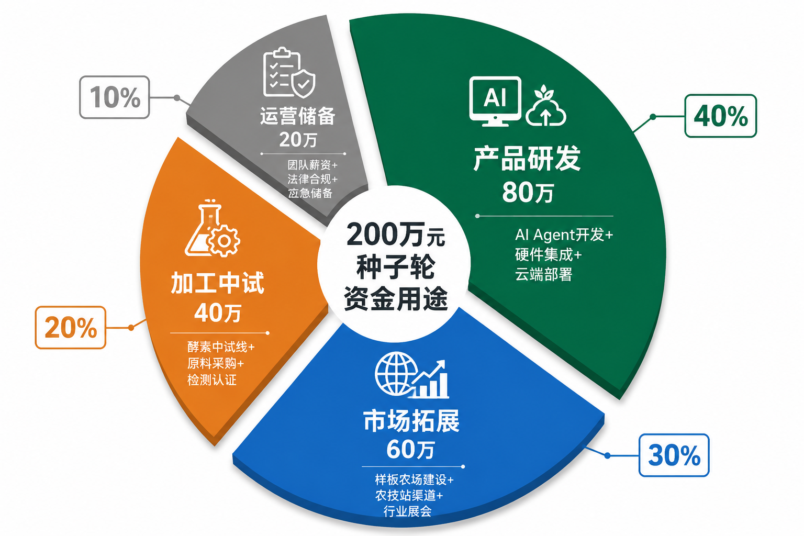

投资净现值。银行短期借款利率 5.85%，综合考虑资金机会成本和投资风险性，i 取 12%。NPV = ∑(CI - CO)ₜ(1 + i)⁻ᵗ = 312 万元（t = 1 至 5）。NPV 远大于零，计算期内盈利能力良好，投资方案可行。

内含报酬率 IRR = 50.09%，远大于资金成本率 5.85%。主要因为产品面向市场空白、前期研发投入可控、SaaS 边际成本递减效应显著。前 5 年内市场增长前景良好。

盈亏平衡分析。SaaS 业务：单位售价（基础版均价）500 元/亩/年，单位可变成本（云计算 + 传感器维护）80 元/亩/年，固定成本 120 万元/年。盈亏平衡点 = 1,200,000 / (500 - 80) ≈ 2,857 亩。按市场渗透计划，预计第二年末至第三年中期达到。加工业务（酵素添加剂）：单位售价 8,000 元/吨，单位可变成本 4,200 元/吨，部门固定成本 45 万元/年。盈亏平衡点 = 450,000 / (8,000 - 4,200) ≈ 118 吨，第三年计划产量 180 吨以上，超过平衡点。

## 8. 财务分析

投资分析回答了"值不值得投"，财务分析回答"能不能活下去、能活多好"。

主要财务假设：公司享受大学生创业和高新技术企业税收优惠——"两免三减半"，前两年免征企业所得税，第三至第五年减按 12.5% 征收。固定资产（生产设备）使用寿命 10 年，期末无残值，直线法折旧。无形资产按 10 年摊销，无残值。自盈利之年起以净利润 25% 分红。应收账款按销售收入 15% 计算，应付账款按销售成本 20% 计算。

损益表（最可能情景）：

| 项目（万元） | 第一年 | 第二年 | 第三年 |
|-------------|--------|--------|--------|
| **营业收入** | **40** | **240** | **950** |
| SaaS 收入 | 25 | 120 | 560 |
| 硬件收入 | 10 | 40 | 120 |
| 加工产品收入 | 5 | 80 | 270 |
| 减：营业成本 | 20 | 110 | 380 |
| **毛利** | **20** | **130** | **570** |
| 毛利率 | 50.0% | 54.2% | 60.0% |
| 减：销售费用 | 35 | 50 | 70 |
| 减：管理费用 | 15 | 25 | 40 |
| 减：研发费用 | 50 | 55 | 80 |
| 减：折旧与摊销 | 3 | 5 | 8 |
| **营业利润** | **-83** | **-5** | **372** |
| 加：营业外收入 | 15 | 10 | 5 |
| 减：财务费用 | 2 | 3 | 4 |
| **利润总额** | **-70** | **2** | **373** |
| 减：所得税 | 0 | 0 | 47 |
| **净利润** | **-70** | **2** | **326** |

第一年亏损约 70 万元，属正常投入期。第二年基本盈亏平衡。第三年净利润约 326 万元，净利润率 34.3%，呈现高成长科技企业的典型特征。

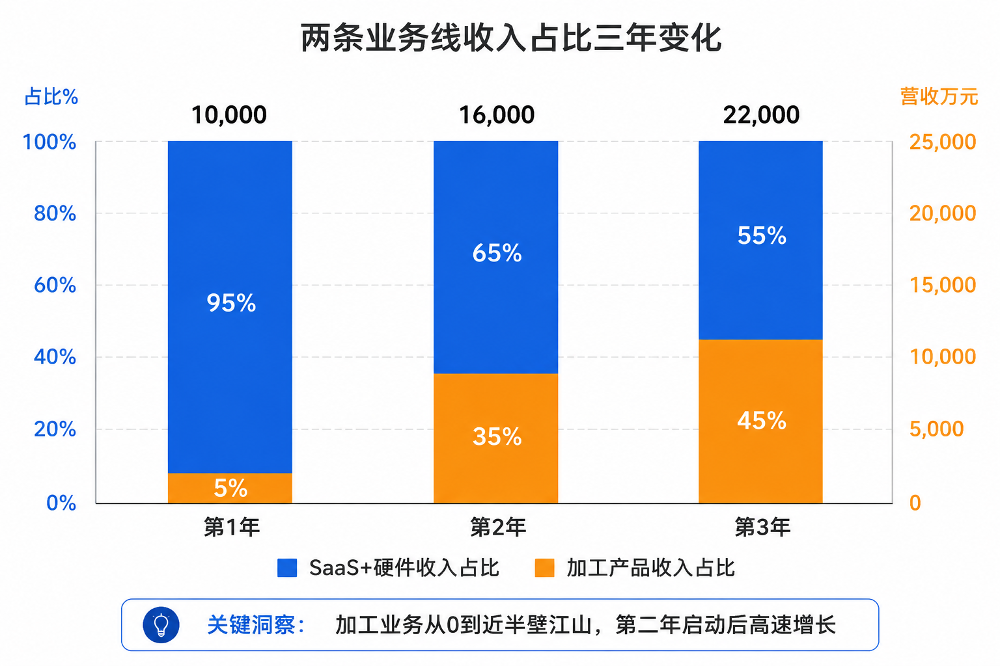

现金流量表：

| 项目（万元） | 第一年 | 第二年 | 第三年 |
|-------------|--------|--------|--------|
| 经营活动净现金流 | -70 | 24 | 273 |
| 投资活动净现金流 | -45 | -15 | -28 |
| 筹资活动净现金流 | 280 | 20 | -82 |
| **现金净增加额** | **165** | **29** | **163** |
| 期初现金余额 | 0 | 165 | 194 |
| **期末现金余额** | **165** | **194** | **357** |

现金流健康，无资金链风险。第三年末现金余额 357 万元，为后续发展提供充足储备。

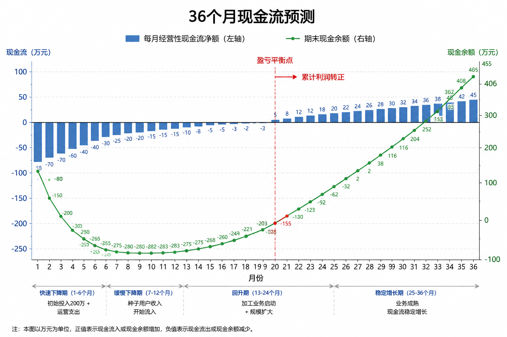

第三年末资产负债表：资产负债率 23.5%，处于极为健康的水平。流动比率 3.73，短期偿债能力强。

| 项目 | 金额 | 项目 | 金额 |
|------|------|------|------|
| 货币资金 | 357 万 | 短期借款 | 50 万 |
| 应收账款 | 143 万 | 应付账款 | 84 万 |
| 固定资产（净额） | 52 万 | 实收资本 | 300 万 |
| 无形资产（净额） | 18 万 | 未分配利润 | 136 万 |
| **资产总计** | **570 万** | **负债与权益总计** | **570 万** |

## 9. 管理体系

财务数字背后是人。谁来做，怎么管，团队凭什么让人放心。

有限责任公司。初期采取直线制组织结构，总经理直接向董事会负责。三至五年后随产品线扩展，逐步过渡到事业部型结构。董事会由大股东组成，负责制定总体发展战略、决定总经理人选、审批重大投融资决策。总经理由罗应杰担任，负责日常经营事务，对董事会负责。下设四个部门：技术研发部负责耕云平台的产品开发与迭代——AI Agent 算法、气象降尺度模型、计算机视觉病虫害识别、作物生长模型、前后端开发和平台运维，以及知识产权管理；市场营销部负责粤西及华南市场的客户拓展和维护，组织田间示范会和行业推广，管理渠道合作伙伴，品牌建设和内容运营；加工生产部负责副产品深加工板块的全面运营，包括原料采购、生产排程、质量控制、仓储物流；财务行政部负责资金筹集与分配、财务计划与分析、税务申报、日常会计，同时兼管行政人事。

管理团队的核心成员。

罗应杰（CEO / CTO），广东海洋大学大气科学专业在读，研究方向为数值天气预报与机器学习。主持耕云平台气象灾害预警 Agent 的核心算法开发，熟悉 CMA/ECMWF/GFS 数值预报产品的获取、处理和降尺度应用。负责公司技术战略和产品架构。

黄子格（COO），广东海洋大学水产学院在读，湛江本地人，熟悉粤西方言和农业圈子。在前期调研中深入走访徐闻、雷州、遂溪三地 15 户种植户，对粤西农业一线有深入理解。负责日常运营、客户关系、供应链和市场营销。

梁秀娟（战略顾问），广东海洋大学管理学院副教授，长期从事创新创业教育与企业战略研究，指导学生团队多次在"挑战杯""互联网+"等赛事获省级以上奖项。为项目提供商业模式设计和融资策略指导。

农艺顾问团队：湛江市农业科学研究院两位高级农艺师（热带果树方向和土壤肥料方向各一人），确保产品设计紧贴一线种植需求。

人力资源计划：

| 时间 | 总人数 | 研发 | 销售 | 加工生产 | 财务行政 |
|------|--------|------|------|---------|---------|
| 第一年末 | 10 | 5 | 2 | 2 | 1 |
| 第二年末 | 18 | 8 | 5 | 4 | 1 |
| 第三年末 | 30 | 12 | 8 | 8 | 2 |

研发岗位优先从广东海洋大学应届毕业生中招聘，适当引进 1—2 名有互联网经验的资深工程师。销售岗位招聘粤西本地农业院校毕业生。加工生产通过本地劳动力市场招聘。

## 10. 机遇与风险

团队到位了，钱到位了，接下来要看清楚前路——什么能成全你，什么能毁掉你。

先说机遇。国家政策大力支持智慧农业和数字乡村建设，2025 年中央一号文件将智慧农业列为重点方向，广东省"百千万工程"为粤西数字农业提供专项资金。粤西热带作物种植面积超 300 万亩，产值超 200 亿元，但 AI 种植决策渗透率几乎为零——巨大空白，显著先发优势。团队拥有全国唯一的大气科学 × 热带农业 × AI 跨学科组合，这一壁垒短期内难以复制。种植群体代际更替（从 55 岁以上向 35 岁以下过渡）正在推动数字化支付意愿持续提升。副产品深加工方向受环保政策和循环经济产业政策双重利好。东南亚市场热带作物种植面积是粤西的十倍以上，中长期国际化想象空间巨大。

外部风险方面，农业数据安全和隐私保护相关法规尚在完善中，可能出现新的合规要求。互联网大厂可能通过资金和渠道优势进入农业 AI 赛道。传统农业信息化企业可能以低价竞争策略抢夺份额。农业受气象条件影响极大，极端天气可能影响种植户收入进而影响支付意愿。宏观经济环境影响风险投资和银行贷款的利率和可获得性。

内部风险方面，创始团队均为在校大学生，缺乏全职企业运营经验，在团队管理和财务管控方面存在学习成本。SaaS 定价策略和销售模式需要在实际运营中不断试错。加工板块产能爬坡可能慢于预期。核心技术人员流失可能影响产品迭代速度。市场教育进度不及预期时，种植户付费转化率可能偏低。

风险不是不前进的理由，而是前进时必须铺好的安全垫。具体应对：密切跟踪农业数据安全法规动态，提前建立数据安全管理制度和用户隐私保护机制。快速建立"热带作物 AI = 耕云"的用户心智定位，以本地化深度服务对抗大厂通用化产品。通过持续数据积累和模型迭代构建技术壁垒。建立产品效果追踪和客户成功体系，确保投入产出比可量化验证。与核心技术人员签署竞业限制和服务期协议，建立股权激励机制（期权池预留 10%）。邀请具有企业运营经验的资深人士加入董事会或担任顾问。加工板块采取稳健的产能建设节奏——先小规模中试线验证，再根据订单逐步扩产。

## 11. 风险资本的退出

风险资金退出成功与否，关键取决于公司业绩和发展前景。

退出方式有三。第一，股权转让。潜在投资人以行业投资者为主——大疆农业、极飞科技等智慧农业头部企业，托普云农、神州信息等农业信息化上市公司，以及关注农业科技赛道的产业投资基金。退出定价采用市盈率法：以退出时年度净利润乘以市盈率（农业科技私募市场一般为 8—12 倍）计算企业价值。以第三年净利润 326 万元为基数，保守市盈率 8 倍，企业价值约 2,608 万元。风险投资方占股 66.7%，对应股权价值约 1,739 万元，相对于 200 万元初始投资，回报倍数约 8.7 倍。

第二，科创板或北交所上市。公司属于具有自主知识产权和高成长性的科技型企业，符合科创板"硬科技"定位或北交所服务创新型中小企业的定位。上市将为风险投资提供流动性最好的退出通道。

第三，剩余利润分红。预计公司从第二年开始盈利，按净利润约 25% 分配红利。以第三年净利润 326 万元计，分红约 82 万元，风险投资方获约 54 万元。

建议风险投资方持有期 5—7 年。前 3 年为高速成长期，企业价值增长最快；第 4—5 年为稳定增长期，此时启动退出可获较优回报。具体时机综合实际经营状况、资本市场环境和投资人意愿确定。

## 附录一：前期调研报告

以上所有判断——市场有多大、用户买不买、渠道怎么走——都不是坐在学校实验室里拍脑袋想出来的。2025 年 12 月到 2026 年 2 月，我们跑了三个县，聊了 15 户种植户，看了 3 家加工厂。这份调研报告是整份计划书的地基。

调研围绕五个核心问题展开：粤西种植户在种植决策中面临的核心痛点及其严重程度；种植户对 AI 种植决策工具的认知度、接受度和付费意愿；种植户的决策行为特征和信息获取渠道；农产品副产品的产生量、当前处置方式和潜在利用价值；耕云平台的市场容量预测及分销促销方法。

采用深度定性访谈为主、实地观察和二手数据收集为辅的方式。设计调研问卷和深度访谈提纲后，通过试调研修改完善。初调研于 2025 年 12 月 10 日至 2026 年 1 月 15 日进行，覆盖 15 户种植户的深度访谈和 3 处加工厂的现场调研。补充调研于 2026 年 2 月 20 日至 3 月 5 日进行，针对特定问题回访和数据补充。

样本全部分布于湛江市下辖的徐闻县、雷州市、遂溪县三个热带作物主产区。深度访谈对象覆盖了不同种植规模、不同作物类型和不同年龄段，以保证代表性。

| 维度 | 分类 | 样本数 |
|------|------|--------|
| 地区 | 徐闻县 | 7 |
| | 雷州市 | 5 |
| | 遂溪县 | 3 |
| 作物 | 菠萝 | 6 |
| | 芒果 | 4 |
| | 甘蔗 | 3 |
| | 荔枝/香蕉 | 2 |
| 规模 | 50 亩以下 | 3 |
| | 50—200 亩 | 5 |
| | 200—500 亩 | 4 |
| | 500 亩以上 | 3 |
| 年龄段 | 35 岁以下 | 3 |
| | 35—50 岁 | 5 |
| | 50 岁以上 | 7 |

> **调研说明**：当前阶段采用深度定性访谈方法，样本量 15 户，属于探索性调研，旨在发现核心趋势和建立研究假设。选择定性访谈而非大规模问卷的原因有三：（1）农业技术产品的用户需求高度依赖场景细节，封闭式问卷难以捕捉；（2）种植户对"AI 种植决策"这一新概念缺乏认知基础，需要访谈者充分说明后才能获得有效反馈；（3）发现关键购买决策因素和信任路径比获得精确统计数据更为优先。下一阶段（2026 年下半年）将基于本次发现，设计 100 份以上的结构化定量问卷，进行统计抽样调研。

### 一、种植决策痛点分析

粤西种植户面临五个层次的痛点，按严重程度排列。

气象灾害冲击是最普遍的痛点，15 户中 14 户列为首要或次要。粤西地处北热带季风区，台风、暴雨、干旱交替冲击。徐闻县每年平均受 2—4 个台风影响，菠萝在抽蕾期遭遇台风可减产 30%—50%。但种植户获取气象信息的主要渠道是手机自带的天气预报和央视天气预报，这些通用服务无法提供农业维度的精细化预报——比如"未来 48 小时内你的地块降雨量将超过 50mm，建议提前排水"。更要命的是，种植户普遍缺乏将气象预报转化为农事决策的能力。"知道要来台风，但不知道提前多久清沟最合适。"（徐闻菠萝种植户陈叔，55 岁，80 亩）

病虫害反应滞后，15 户中 12 户提及。菠萝心腐病、芒果炭疽病、甘蔗螟虫是粤西三大主要病虫害。种植户的病虫害发现严重依赖人工巡检——每天巡田一次，靠肉眼观察叶片颜色和形态变化。但热带病虫害从初现症状到大面积爆发往往只需 5—7 天，人工巡检的频次和覆盖度远远不够。"等我能看到黄叶的时候，已经晚了至少五天。"（雷州芒果种植户吴老板，34 岁，120 亩）12 户提及病虫害问题的种植户中，9 户在过去三年中至少经历过一次因发现不及时导致的严重减产。

水肥管理粗放，15 户中 11 户提及。施肥和灌溉决策主要靠经验——"看着叶子颜色施肥""摸着土干了就浇水"。这导致两个后果：一是为保险过量施肥，每亩年均化肥投入比科学施肥方案高出 20%—30%，同时造成土壤酸化和面源污染；二是灌溉时机不当，旱季浇水不足减产，雨季排水不及烂根。仅 2 户大型种植户（500 亩以上）安装了水肥一体化设备，但即使有设备，施肥配比和灌溉量的决策仍依赖操作人员经验。

劳动力短缺与老龄化，15 户中 10 户提及。粤西农业从业者平均年龄超过 55 岁。年轻劳动力外流至珠三角务工，留在农村的大多是中老年人。多名受访者表达了对"种不动了"的担忧——不仅是体力，学习新技术的能力也在下降。但与此同时，35 岁以下的 3 户年轻种植户全部展现出更强的数字化意愿：用抖音学种植技术、用微信管客户、用手机银行处理资金，对"AI 助手帮我看田"的接受度远高于年长一代。

副产品浪费严重。15 户全部知晓，但仅 3 户正视。菠萝皮渣——包括菠萝头、果皮、果芯、残次果——通常直接堆在田头腐烂或运到垃圾站填埋，占菠萝原料重量的 40%—50%。按徐闻县年产菠萝约 70 万吨计算，仅菠萝皮渣一年就产生约 30 万吨废弃物。多数种植户表示"一直都是这样处理的，没想过还能卖钱"。3 户听说过可以加工利用，但缺技术和销路。

### 二、数字化意愿与付费意愿

代际差异鲜明。35 岁以下 100% 表示愿意尝试 AI 种植工具，最关注"能省多少人工"。35—50 岁 60% 表示"看别人用了效果好就用"，最关注"能增产多少"。50 岁以上仅 29% 愿意尝试，最大顾虑是"学不会怎么用"。

SaaS 年费可接受范围 3.5—10.0 元/亩/月，折合年费 42—1,200 元/亩。中位数约 50 元/亩/月，折合年费 600 元/亩。基础版定价 400 元/亩/年（约 33 元/亩/月）处于用户舒适区间。

购买决策因素按重要性排序

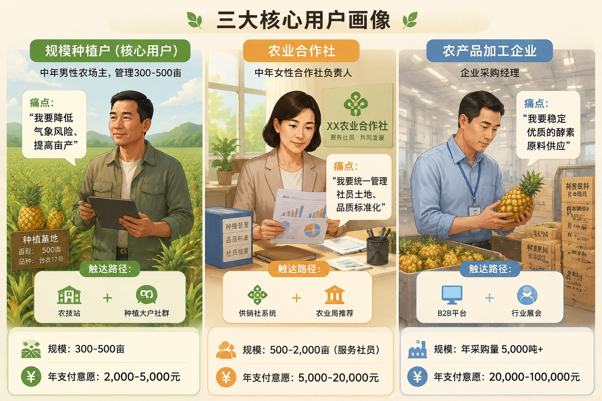

看到实际增产数据（15/15），操作是否简单（14/15），价格（12/15），熟人推荐或政府背书（10/15），售后保障（8/15）。

核心发现：90% 的受访对象表示看到同行数据和增产案例就愿意付费。"广告轰炸"模式在农业领域基本无效，"案例驱动 + 熟人推荐"是唯一有效的推广路径。值得注意的是，1 户明确表示"绝对不买任何软件服务，种地不需要那些"——提示我们即使在最优情况下，市场渗透率也存在天花板。

### 三、副产品加工的市场基础

团队走访了徐闻县 3 家菠萝加工厂。某罐头加工厂，年加工菠萝 5,000 吨，每年产生菠萝皮渣约 2,200 吨，目前全部免费送给附近养殖户作为饲料补充。但养殖户消化不了这么多量，大量积压在厂区产生异味和污染。厂长表示"如果有人能全部拉走处理，免费给都行，我们每年还要花几万块请人清理"。某果汁加工厂，年加工菠萝 3,000 吨，每年产生皮渣约 1,300 吨，目前在厂区后堆放自然发酵后作有机肥返田，但处理周期长、占地大、气味重。厂长对"能不能做成饲料卖钱"表示出浓厚兴趣，甚至愿意出资合作。雷州某芒果种植加工一体化企业，每年产生芒果皮核约 800 吨，部分堆肥，部分废弃。企业负责人对芒果皮果酒概念有兴趣，但担心酿酒品质和市场销路。

这些调研直接验证了副产品深加工板块的原料供应充分且成本极低——加工厂愿意以零成本甚至负成本出让副产品原料。

## 附录二：核心技术

智慧农业的核心瓶颈不在于硬件采集，而在于决策智能。现有的解决方案大多实现了"数据看得见"——传感器采集和可视化——但"决策靠人做"。种植户面对满屏数据图表，仍然不知道今天该不该浇水、该不该打药。

海韵智耕的技术突破在于让 AI 完成从数据到决策的完整闭环。热带作物种植场景对 AI 有三重特殊挑战：气象条件极端且变化剧烈——台风、暴雨、干旱交替，通用气象服务无法满足农业级预报精度；作物-环境-病虫害的交互关系高度复杂——同一病害在不同温湿度下爆发速度差异巨大；种植户群体不熟悉技术——AI 的输出必须是自然语言形式的具体行动建议，而非专业图表。

团队依托广东海洋大学大气科学学科优势——该校大气科学专业是华南地区唯一的海洋气象特色专业——结合计算机视觉、时间序列预测和多模态数据融合等 AI 技术，构建了专门面向热带作物种植场景的 AI Agent 系统。

四项核心技术创新构筑了系统底座。

面向热带作物的气象数值预报降尺度模型。CMA 发布的全球和区域数值预报产品空间分辨率通常为 9km—25km，对地块级农业决策精度不足。团队开发了基于 CNN 和注意力机制的统计降尺度模型，将 GFS 和 ECMWF 全球模式预报从 25km 分辨率降尺度到 1km，并结合广东海洋大学自有的粤西气象观测数据进行偏差订正。2025 年台汛期验证中，该模型对徐闻地区 72 小时降水预报的 TS 评分达到 0.72，显著优于插值降尺度（0.58）和原始 GFS 预报（0.45）。

多源土壤感知数据融合算法。FDR（频域反射）传感器受土壤盐分干扰大，TDR（时域反射）传感器成本高，张力计响应慢。团队开发了基于卡尔曼滤波的多传感器数据融合算法，将低成本 FDR 传感器与少量 TDR 校准传感器的数据融合，在保持低成本的同时将土壤含水量测量误差降至 5% 以内。该算法已在试验田连续运行三个月，验证了在不同土壤类型（砂壤土、黏壤土）和不同降雨条件下的稳定性。

热带作物病虫害计算机视觉识别。针对菠萝心腐病、芒果炭疽病、甘蔗螟虫等粤西主要病虫害，团队基于 YOLOv8 目标检测和 EfficientNet 分类架构，训练了病虫害早期症状识别模型。训练数据来自田间实地拍摄（5,000+ 标注图像）和公开农业病虫害数据集（PlantVillage、IP102）的迁移学习。模型对菠萝心腐病早期症状（叶片基部水渍状变色）识别准确率 84%，平均比人眼识别提前 3—5 天。

基于知识图谱的 AI Agent 决策架构。耕云平台的核心不是单一大模型调用，而是由八个专业化 Agent 组成的多智能体系统。每个 Agent 负责一个决策维度，通过共享消息总线协同。这种架构有三个优势：每个 Agent 可使用最适合自身任务的小型专用模型，而非依赖一个昂贵的通用大模型；Agent 之间互相校验——气象预警 Agent 预测暴雨后，水肥决策 Agent 自动调整灌溉建议；系统具有良好可扩展性——新增决策维度只需增加新 Agent，无需修改现有 Agent。

技术可行性方面，基于深度学习的统计降尺度已是气象领域近年研究热点，大量文献证明 CNN 和注意力机制在降水、温度等要素的降尺度任务上显著优于传统插值和统计回归，团队使用的模型架构已在 ECMWF 专题研讨会上获得学术界认可。关键保障：粤西地区拥有较密的自动气象站网（平均站间距约 15km），为模型训练提供充足地面真实数据。计算机视觉病虫害识别已是技术相对成熟的领域，PlantVillage 数据集（54,000+ 标注图像）和 IP102 数据集（75,000+ 标注图像，覆盖 102 种害虫）为预训练提供了充足基础。技术挑战不在模型本身，而在田间采集条件的复杂性——光照变化、叶片遮挡、背景干扰。团队通过在智能手机端部署轻量化模型（TensorFlow Lite），让种植户用手机拍照上传即可实时获得识别结果和防治建议。副产品加工方面，三项技术的核心工艺均已有成熟的工业化先例，团队的创新在于针对粤西本地原料特性进行了工艺参数优化，中试线采用的均为常规发酵和成型设备，技术风险低，产业化路径清晰。

技术认证与知识产权。团队已围绕核心技术申请 3 项国家发明专利：（1）"一种面向热带作物的多源气象数据降尺度方法"（申请中）；（2）"一种基于多传感器融合的土壤含水量监测方法"（申请中）；（3）"一种菠萝皮渣复合菌种发酵制备饲料添加剂的方法"（申请中）。另有 5 项软件著作权正在办理中，涵盖耕云平台的气象预警模块、土壤墒情模块、病虫害识别模块、水肥决策模块和用户前端系统。本项目的核心技术曾在 2025 年"挑战杯"全国大学生课外学术科技作品竞赛中获得广东赛区一等奖，并在 2026 年"互联网+"大学生创新创业大赛中获得广东赛区银奖。

---

*本商业计划书由海韵智耕创业团队编写，仅供投资人评估参考，未经许可不得对外传播。*

*联系方式：广东海洋大学科技园 · 湛江市麻章区海大路 1 号*

*日期：2026 年 4 月*
